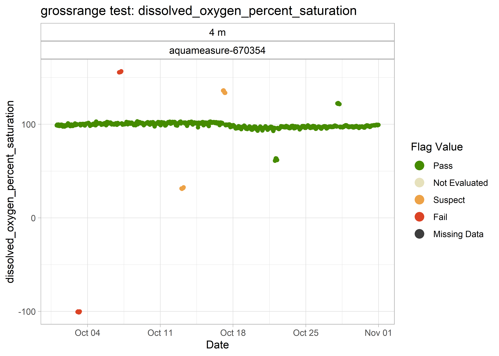
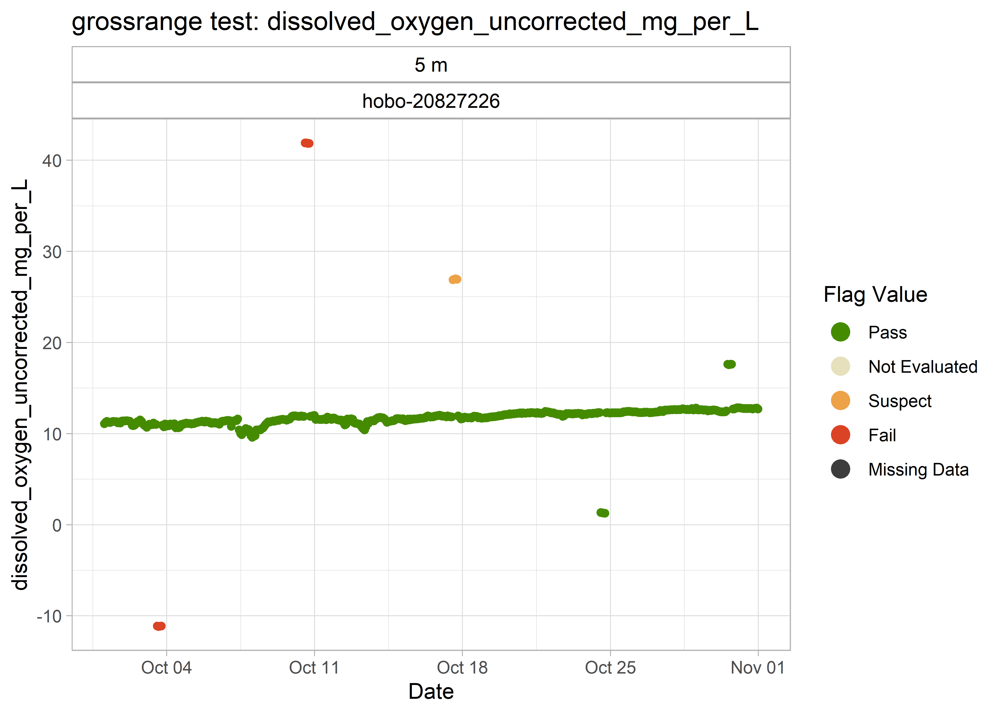
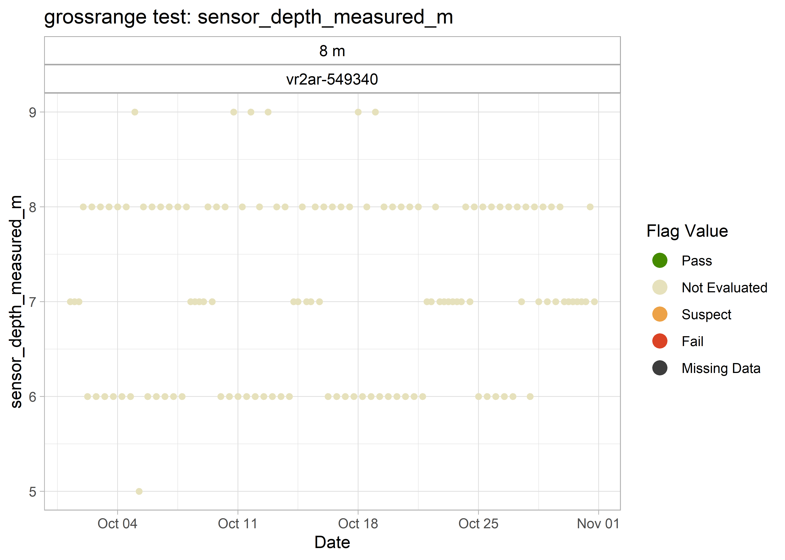
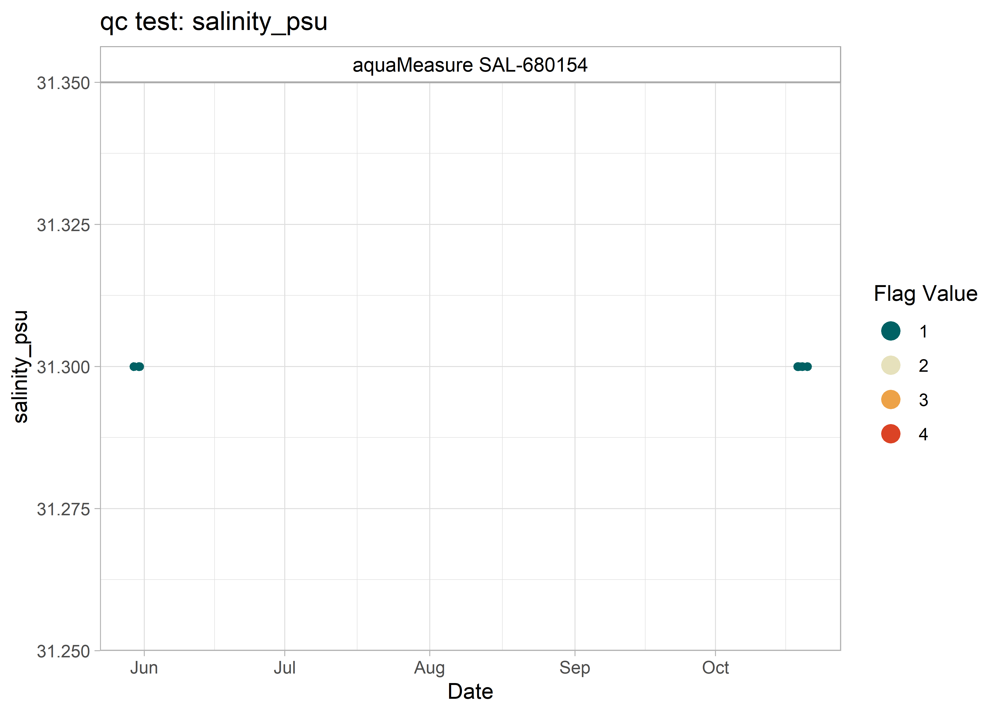
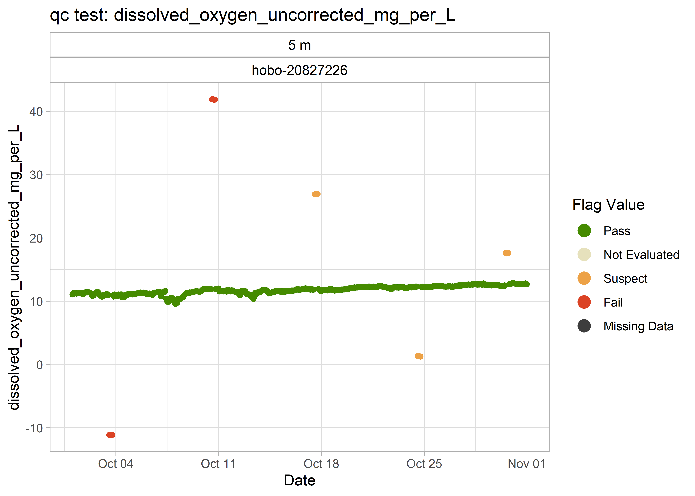
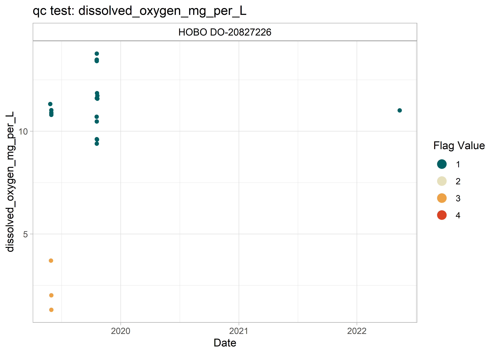

<!-- README.md is generated from README.Rmd. Please edit that file -->

# qaqcmar


<!-- badges: start -->

[](https://www.gnu.org/licenses/gpl-3.0)
[](https://github.com/dempsey-cmar/qaqcmar)
[](https://www.codefactor.io/repository/github/dempsey-cmar/qaqcmar)
[](https://github.com/dempsey-CMAR/qaqcmar/actions/workflows/R-CMD-check.yaml)
<!-- badges: end -->

The goal of qaqcmar is to apply quality control flags to Water Quality
data collected through the Centre for Marine Applied Research’s (CMAR)
Coastal Monitoring Program.

## Installation

You can install the development version of qaqcmar from
[GitHub](https://github.com/) with:

``` r
# install.packages("devtools")
devtools::install_github("dempsey-CMAR/qaqcmar")
```

## Background

-   Coastal Monitoring Program

-   QARTOD manuals

-   Tests that we are planning to run (include table)

-   Flagging scheme (include table)

-   Thresholds … defaults built into the package

## Example

``` r
library(qaqcmar)
library(sensorstrings)
library(dplyr)
library(kableExtra)
library(lubridate)
```

### Example Sensor String Data

Consider Water Quality data collected from xx to xx.

``` r
# read in example data
path <- system.file("testdata", package = "qaqcmar")

dat <- read.csv(paste0(path, "/example_data.csv")) %>% 
  select(
    sensor, timestamp_utc, 
    contains(c("depth", "temperature", "salinity", "dissolved_oxygen"))
  ) %>% 
  mutate(timestamp_utc = as_datetime(timestamp_utc))

kable(dat[1:5, ])
```

<table>
<thead>
<tr>
<th style="text-align:left;">
sensor
</th>
<th style="text-align:left;">
timestamp_utc
</th>
<th style="text-align:right;">
sensor_depth_at_low_tide_m
</th>
<th style="text-align:right;">
sensor_depth_measured_m
</th>
<th style="text-align:right;">
temperature_degree_C
</th>
<th style="text-align:right;">
salinity_psu
</th>
<th style="text-align:right;">
dissolved_oxygen_mg_per_L
</th>
<th style="text-align:right;">
dissolved_oxygen_percent_saturation
</th>
</tr>
</thead>
<tbody>
<tr>
<td style="text-align:left;">
HOBO Pro V2-10755220
</td>
<td style="text-align:left;">
2019-05-29 18:00:00
</td>
<td style="text-align:right;">
2
</td>
<td style="text-align:right;">
NA
</td>
<td style="text-align:right;">
12.243
</td>
<td style="text-align:right;">
NA
</td>
<td style="text-align:right;">
NA
</td>
<td style="text-align:right;">
NA
</td>
</tr>
<tr>
<td style="text-align:left;">
HOBO Pro V2-10755220
</td>
<td style="text-align:left;">
2019-05-30 19:00:00
</td>
<td style="text-align:right;">
2
</td>
<td style="text-align:right;">
NA
</td>
<td style="text-align:right;">
7.870
</td>
<td style="text-align:right;">
NA
</td>
<td style="text-align:right;">
NA
</td>
<td style="text-align:right;">
NA
</td>
</tr>
<tr>
<td style="text-align:left;">
HOBO Pro V2-10755220
</td>
<td style="text-align:left;">
2019-05-30 20:00:00
</td>
<td style="text-align:right;">
2
</td>
<td style="text-align:right;">
NA
</td>
<td style="text-align:right;">
6.585
</td>
<td style="text-align:right;">
NA
</td>
<td style="text-align:right;">
NA
</td>
<td style="text-align:right;">
NA
</td>
</tr>
<tr>
<td style="text-align:left;">
HOBO Pro V2-10755220
</td>
<td style="text-align:left;">
2019-05-30 21:00:00
</td>
<td style="text-align:right;">
2
</td>
<td style="text-align:right;">
NA
</td>
<td style="text-align:right;">
6.661
</td>
<td style="text-align:right;">
NA
</td>
<td style="text-align:right;">
NA
</td>
<td style="text-align:right;">
NA
</td>
</tr>
<tr>
<td style="text-align:left;">
HOBO Pro V2-10755220
</td>
<td style="text-align:left;">
2019-05-30 22:00:00
</td>
<td style="text-align:right;">
2
</td>
<td style="text-align:right;">
NA
</td>
<td style="text-align:right;">
6.661
</td>
<td style="text-align:right;">
NA
</td>
<td style="text-align:right;">
NA
</td>
<td style="text-align:right;">
NA
</td>
</tr>
</tbody>
</table>

``` r
ss_plot_variables_at_depth(dat)
```


### Apply QC flags

There is a separate function for each QC test. For example,
`qc_test_grossrange()` applies the gross range test by adding a a
`grossrange_flag_**` column for each variable in `dat`.

*Possibly add table here*

#### Gross Range Test

Apply test:

``` r
dat_gr <- qc_test_grossrange(dat)

kable(dat_gr[1:5, ])
```

<table>
<thead>
<tr>
<th style="text-align:left;">
sensor
</th>
<th style="text-align:left;">
timestamp_utc
</th>
<th style="text-align:right;">
sensor_depth_at_low_tide_m
</th>
<th style="text-align:right;">
value_temperature_degree_C
</th>
<th style="text-align:right;">
value_dissolved_oxygen_percent_saturation
</th>
<th style="text-align:right;">
value_salinity_psu
</th>
<th style="text-align:right;">
value_sensor_depth_measured_m
</th>
<th style="text-align:right;">
value_dissolved_oxygen_mg_per_L
</th>
<th style="text-align:left;">
grossrange_flag_temperature_degree_C
</th>
<th style="text-align:left;">
grossrange_flag_dissolved_oxygen_percent_saturation
</th>
<th style="text-align:left;">
grossrange_flag_salinity_psu
</th>
<th style="text-align:left;">
grossrange_flag_sensor_depth_measured_m
</th>
<th style="text-align:left;">
grossrange_flag_dissolved_oxygen_mg_per_L
</th>
</tr>
</thead>
<tbody>
<tr>
<td style="text-align:left;">
HOBO Pro V2-10755220
</td>
<td style="text-align:left;">
2019-05-29 18:00:00
</td>
<td style="text-align:right;">
2
</td>
<td style="text-align:right;">
12.243
</td>
<td style="text-align:right;">
NA
</td>
<td style="text-align:right;">
NA
</td>
<td style="text-align:right;">
NA
</td>
<td style="text-align:right;">
NA
</td>
<td style="text-align:left;">
1
</td>
<td style="text-align:left;">
NA
</td>
<td style="text-align:left;">
NA
</td>
<td style="text-align:left;">
NA
</td>
<td style="text-align:left;">
NA
</td>
</tr>
<tr>
<td style="text-align:left;">
HOBO Pro V2-10755220
</td>
<td style="text-align:left;">
2019-05-30 19:00:00
</td>
<td style="text-align:right;">
2
</td>
<td style="text-align:right;">
7.870
</td>
<td style="text-align:right;">
NA
</td>
<td style="text-align:right;">
NA
</td>
<td style="text-align:right;">
NA
</td>
<td style="text-align:right;">
NA
</td>
<td style="text-align:left;">
1
</td>
<td style="text-align:left;">
NA
</td>
<td style="text-align:left;">
NA
</td>
<td style="text-align:left;">
NA
</td>
<td style="text-align:left;">
NA
</td>
</tr>
<tr>
<td style="text-align:left;">
HOBO Pro V2-10755220
</td>
<td style="text-align:left;">
2019-05-30 20:00:00
</td>
<td style="text-align:right;">
2
</td>
<td style="text-align:right;">
6.585
</td>
<td style="text-align:right;">
NA
</td>
<td style="text-align:right;">
NA
</td>
<td style="text-align:right;">
NA
</td>
<td style="text-align:right;">
NA
</td>
<td style="text-align:left;">
1
</td>
<td style="text-align:left;">
NA
</td>
<td style="text-align:left;">
NA
</td>
<td style="text-align:left;">
NA
</td>
<td style="text-align:left;">
NA
</td>
</tr>
<tr>
<td style="text-align:left;">
HOBO Pro V2-10755220
</td>
<td style="text-align:left;">
2019-05-30 21:00:00
</td>
<td style="text-align:right;">
2
</td>
<td style="text-align:right;">
6.661
</td>
<td style="text-align:right;">
NA
</td>
<td style="text-align:right;">
NA
</td>
<td style="text-align:right;">
NA
</td>
<td style="text-align:right;">
NA
</td>
<td style="text-align:left;">
1
</td>
<td style="text-align:left;">
NA
</td>
<td style="text-align:left;">
NA
</td>
<td style="text-align:left;">
NA
</td>
<td style="text-align:left;">
NA
</td>
</tr>
<tr>
<td style="text-align:left;">
HOBO Pro V2-10755220
</td>
<td style="text-align:left;">
2019-05-30 22:00:00
</td>
<td style="text-align:right;">
2
</td>
<td style="text-align:right;">
6.661
</td>
<td style="text-align:right;">
NA
</td>
<td style="text-align:right;">
NA
</td>
<td style="text-align:right;">
NA
</td>
<td style="text-align:right;">
NA
</td>
<td style="text-align:left;">
1
</td>
<td style="text-align:left;">
NA
</td>
<td style="text-align:left;">
NA
</td>
<td style="text-align:left;">
NA
</td>
<td style="text-align:left;">
NA
</td>
</tr>
</tbody>
</table>

The flagged data can be plotted with `qc_plot_all_tests()`, specifying
argument `qc_tests = "grossrange"`.

``` r
qc_plot_all_tests(dat_gr, qc_tests = "grossrange")
#> $temperature_degree_C
#> $temperature_degree_C$grossrange
```


    #> 
    #> 
    #> $dissolved_oxygen_percent_saturation
    #> $dissolved_oxygen_percent_saturation$grossrange


    #> 
    #> 
    #> $salinity_psu
    #> $salinity_psu$grossrange



    #> 
    #> 
    #> $sensor_depth_measured_m
    #> $sensor_depth_measured_m$grossrange



    #> 
    #> 
    #> $dissolved_oxygen_mg_per_L
    #> $dissolved_oxygen_mg_per_L$grossrange



#### All Tests

There is no need to call each `qc_test**()` function separately.
`qc_test_all()` will apply all specified QC tests to `dat`.

``` r
dat_qc <- dat %>% 
  qc_test_all(qc_tests = c("climatology", "grossrange")) 
#> Joining, by = c("sensor", "timestamp_utc", "sensor_depth_at_low_tide_m",
#> "value_temperature_degree_C", "value_dissolved_oxygen_percent_saturation",
#> "value_salinity_psu", "value_sensor_depth_measured_m",
#> "value_dissolved_oxygen_mg_per_L")

kable(dat_qc[1:5, ])
```

<table>
<thead>
<tr>
<th style="text-align:left;">
sensor
</th>
<th style="text-align:left;">
timestamp_utc
</th>
<th style="text-align:right;">
sensor_depth_at_low_tide_m
</th>
<th style="text-align:right;">
value_temperature_degree_C
</th>
<th style="text-align:right;">
value_dissolved_oxygen_percent_saturation
</th>
<th style="text-align:right;">
value_salinity_psu
</th>
<th style="text-align:right;">
value_sensor_depth_measured_m
</th>
<th style="text-align:right;">
value_dissolved_oxygen_mg_per_L
</th>
<th style="text-align:left;">
climatology_flag_temperature_degree_C
</th>
<th style="text-align:left;">
climatology_flag_dissolved_oxygen_percent_saturation
</th>
<th style="text-align:left;">
climatology_flag_salinity_psu
</th>
<th style="text-align:left;">
climatology_flag_sensor_depth_measured_m
</th>
<th style="text-align:left;">
climatology_flag_dissolved_oxygen_mg_per_L
</th>
<th style="text-align:left;">
grossrange_flag_temperature_degree_C
</th>
<th style="text-align:left;">
grossrange_flag_dissolved_oxygen_percent_saturation
</th>
<th style="text-align:left;">
grossrange_flag_salinity_psu
</th>
<th style="text-align:left;">
grossrange_flag_sensor_depth_measured_m
</th>
<th style="text-align:left;">
grossrange_flag_dissolved_oxygen_mg_per_L
</th>
</tr>
</thead>
<tbody>
<tr>
<td style="text-align:left;">
HOBO Pro V2-10755220
</td>
<td style="text-align:left;">
2019-05-29 18:00:00
</td>
<td style="text-align:right;">
2
</td>
<td style="text-align:right;">
12.243
</td>
<td style="text-align:right;">
NA
</td>
<td style="text-align:right;">
NA
</td>
<td style="text-align:right;">
NA
</td>
<td style="text-align:right;">
NA
</td>
<td style="text-align:left;">
1
</td>
<td style="text-align:left;">
NA
</td>
<td style="text-align:left;">
NA
</td>
<td style="text-align:left;">
NA
</td>
<td style="text-align:left;">
NA
</td>
<td style="text-align:left;">
1
</td>
<td style="text-align:left;">
NA
</td>
<td style="text-align:left;">
NA
</td>
<td style="text-align:left;">
NA
</td>
<td style="text-align:left;">
NA
</td>
</tr>
<tr>
<td style="text-align:left;">
HOBO Pro V2-10755220
</td>
<td style="text-align:left;">
2019-05-30 19:00:00
</td>
<td style="text-align:right;">
2
</td>
<td style="text-align:right;">
7.870
</td>
<td style="text-align:right;">
NA
</td>
<td style="text-align:right;">
NA
</td>
<td style="text-align:right;">
NA
</td>
<td style="text-align:right;">
NA
</td>
<td style="text-align:left;">
1
</td>
<td style="text-align:left;">
NA
</td>
<td style="text-align:left;">
NA
</td>
<td style="text-align:left;">
NA
</td>
<td style="text-align:left;">
NA
</td>
<td style="text-align:left;">
1
</td>
<td style="text-align:left;">
NA
</td>
<td style="text-align:left;">
NA
</td>
<td style="text-align:left;">
NA
</td>
<td style="text-align:left;">
NA
</td>
</tr>
<tr>
<td style="text-align:left;">
HOBO Pro V2-10755220
</td>
<td style="text-align:left;">
2019-05-30 20:00:00
</td>
<td style="text-align:right;">
2
</td>
<td style="text-align:right;">
6.585
</td>
<td style="text-align:right;">
NA
</td>
<td style="text-align:right;">
NA
</td>
<td style="text-align:right;">
NA
</td>
<td style="text-align:right;">
NA
</td>
<td style="text-align:left;">
1
</td>
<td style="text-align:left;">
NA
</td>
<td style="text-align:left;">
NA
</td>
<td style="text-align:left;">
NA
</td>
<td style="text-align:left;">
NA
</td>
<td style="text-align:left;">
1
</td>
<td style="text-align:left;">
NA
</td>
<td style="text-align:left;">
NA
</td>
<td style="text-align:left;">
NA
</td>
<td style="text-align:left;">
NA
</td>
</tr>
<tr>
<td style="text-align:left;">
HOBO Pro V2-10755220
</td>
<td style="text-align:left;">
2019-05-30 21:00:00
</td>
<td style="text-align:right;">
2
</td>
<td style="text-align:right;">
6.661
</td>
<td style="text-align:right;">
NA
</td>
<td style="text-align:right;">
NA
</td>
<td style="text-align:right;">
NA
</td>
<td style="text-align:right;">
NA
</td>
<td style="text-align:left;">
1
</td>
<td style="text-align:left;">
NA
</td>
<td style="text-align:left;">
NA
</td>
<td style="text-align:left;">
NA
</td>
<td style="text-align:left;">
NA
</td>
<td style="text-align:left;">
1
</td>
<td style="text-align:left;">
NA
</td>
<td style="text-align:left;">
NA
</td>
<td style="text-align:left;">
NA
</td>
<td style="text-align:left;">
NA
</td>
</tr>
<tr>
<td style="text-align:left;">
HOBO Pro V2-10755220
</td>
<td style="text-align:left;">
2019-05-30 22:00:00
</td>
<td style="text-align:right;">
2
</td>
<td style="text-align:right;">
6.661
</td>
<td style="text-align:right;">
NA
</td>
<td style="text-align:right;">
NA
</td>
<td style="text-align:right;">
NA
</td>
<td style="text-align:right;">
NA
</td>
<td style="text-align:left;">
1
</td>
<td style="text-align:left;">
NA
</td>
<td style="text-align:left;">
NA
</td>
<td style="text-align:left;">
NA
</td>
<td style="text-align:left;">
NA
</td>
<td style="text-align:left;">
1
</td>
<td style="text-align:left;">
NA
</td>
<td style="text-align:left;">
NA
</td>
<td style="text-align:left;">
NA
</td>
<td style="text-align:left;">
NA
</td>
</tr>
</tbody>
</table>

There are now 18 columns in `dat_qc`!

`qc_assign_max_flag()` reduces the number of columns in `dat_qc` by
keeping the *worst* flag for each variable.

``` r
dat_qc <- dat_qc %>% 
 qc_assign_max_flag()

kable(dat_qc[1:5, ])
```

<table>
<thead>
<tr>
<th style="text-align:left;">
sensor
</th>
<th style="text-align:left;">
timestamp_utc
</th>
<th style="text-align:right;">
sensor_depth_at_low_tide_m
</th>
<th style="text-align:right;">
value_dissolved_oxygen_mg_per_L
</th>
<th style="text-align:right;">
value_dissolved_oxygen_percent_saturation
</th>
<th style="text-align:right;">
value_salinity_psu
</th>
<th style="text-align:right;">
value_sensor_depth_measured_m
</th>
<th style="text-align:right;">
value_temperature_degree_C
</th>
<th style="text-align:left;">
qc_flag_dissolved_oxygen_mg_per_L
</th>
<th style="text-align:left;">
qc_flag_dissolved_oxygen_percent_saturation
</th>
<th style="text-align:left;">
qc_flag_salinity_psu
</th>
<th style="text-align:left;">
qc_flag_sensor_depth_measured_m
</th>
<th style="text-align:left;">
qc_flag_temperature_degree_C
</th>
</tr>
</thead>
<tbody>
<tr>
<td style="text-align:left;">
HOBO Pro V2-10755220
</td>
<td style="text-align:left;">
2019-05-29 18:00:00
</td>
<td style="text-align:right;">
2
</td>
<td style="text-align:right;">
NA
</td>
<td style="text-align:right;">
NA
</td>
<td style="text-align:right;">
NA
</td>
<td style="text-align:right;">
NA
</td>
<td style="text-align:right;">
12.243
</td>
<td style="text-align:left;">
NA
</td>
<td style="text-align:left;">
NA
</td>
<td style="text-align:left;">
NA
</td>
<td style="text-align:left;">
NA
</td>
<td style="text-align:left;">
1
</td>
</tr>
<tr>
<td style="text-align:left;">
HOBO Pro V2-10755220
</td>
<td style="text-align:left;">
2019-05-30 19:00:00
</td>
<td style="text-align:right;">
2
</td>
<td style="text-align:right;">
NA
</td>
<td style="text-align:right;">
NA
</td>
<td style="text-align:right;">
NA
</td>
<td style="text-align:right;">
NA
</td>
<td style="text-align:right;">
7.870
</td>
<td style="text-align:left;">
NA
</td>
<td style="text-align:left;">
NA
</td>
<td style="text-align:left;">
NA
</td>
<td style="text-align:left;">
NA
</td>
<td style="text-align:left;">
1
</td>
</tr>
<tr>
<td style="text-align:left;">
HOBO Pro V2-10755220
</td>
<td style="text-align:left;">
2019-05-30 20:00:00
</td>
<td style="text-align:right;">
2
</td>
<td style="text-align:right;">
NA
</td>
<td style="text-align:right;">
NA
</td>
<td style="text-align:right;">
NA
</td>
<td style="text-align:right;">
NA
</td>
<td style="text-align:right;">
6.585
</td>
<td style="text-align:left;">
NA
</td>
<td style="text-align:left;">
NA
</td>
<td style="text-align:left;">
NA
</td>
<td style="text-align:left;">
NA
</td>
<td style="text-align:left;">
1
</td>
</tr>
<tr>
<td style="text-align:left;">
HOBO Pro V2-10755220
</td>
<td style="text-align:left;">
2019-05-30 21:00:00
</td>
<td style="text-align:right;">
2
</td>
<td style="text-align:right;">
NA
</td>
<td style="text-align:right;">
NA
</td>
<td style="text-align:right;">
NA
</td>
<td style="text-align:right;">
NA
</td>
<td style="text-align:right;">
6.661
</td>
<td style="text-align:left;">
NA
</td>
<td style="text-align:left;">
NA
</td>
<td style="text-align:left;">
NA
</td>
<td style="text-align:left;">
NA
</td>
<td style="text-align:left;">
1
</td>
</tr>
<tr>
<td style="text-align:left;">
HOBO Pro V2-10755220
</td>
<td style="text-align:left;">
2019-05-30 22:00:00
</td>
<td style="text-align:right;">
2
</td>
<td style="text-align:right;">
NA
</td>
<td style="text-align:right;">
NA
</td>
<td style="text-align:right;">
NA
</td>
<td style="text-align:right;">
NA
</td>
<td style="text-align:right;">
6.661
</td>
<td style="text-align:left;">
NA
</td>
<td style="text-align:left;">
NA
</td>
<td style="text-align:left;">
NA
</td>
<td style="text-align:left;">
NA
</td>
<td style="text-align:left;">
1
</td>
</tr>
</tbody>
</table>

The flagged data can be plotted with `qc_plot_all_tests()`, specifying
argument `qc_tests = "qc"`.

``` r
qc_plot_all_tests(dat_qc, qc_tests = "qc")
#> $temperature_degree_C
#> $temperature_degree_C$qc
```


    #> 
    #> 
    #> $dissolved_oxygen_percent_saturation
    #> $dissolved_oxygen_percent_saturation$qc


    #> 
    #> 
    #> $salinity_psu
    #> $salinity_psu$qc



    #> 
    #> 
    #> $sensor_depth_measured_m
    #> $sensor_depth_measured_m$qc



    #> 
    #> 
    #> $dissolved_oxygen_mg_per_L
    #> $dissolved_oxygen_mg_per_L$qc


