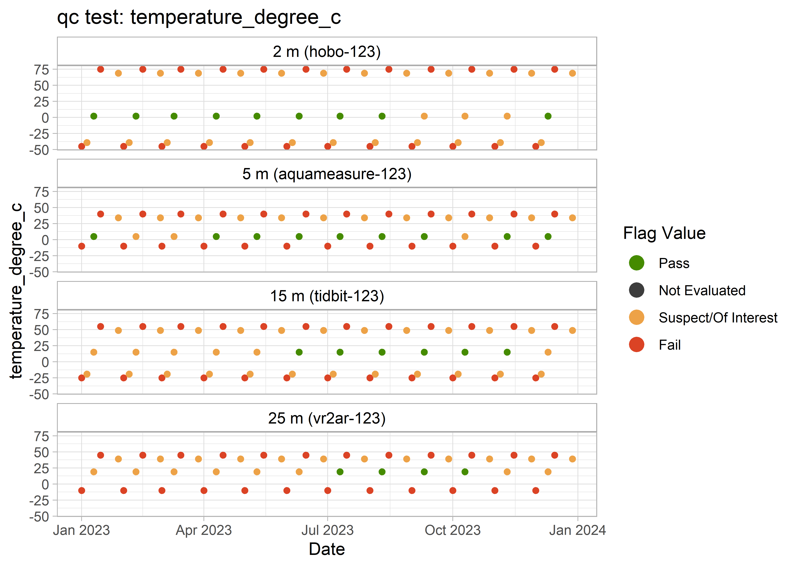
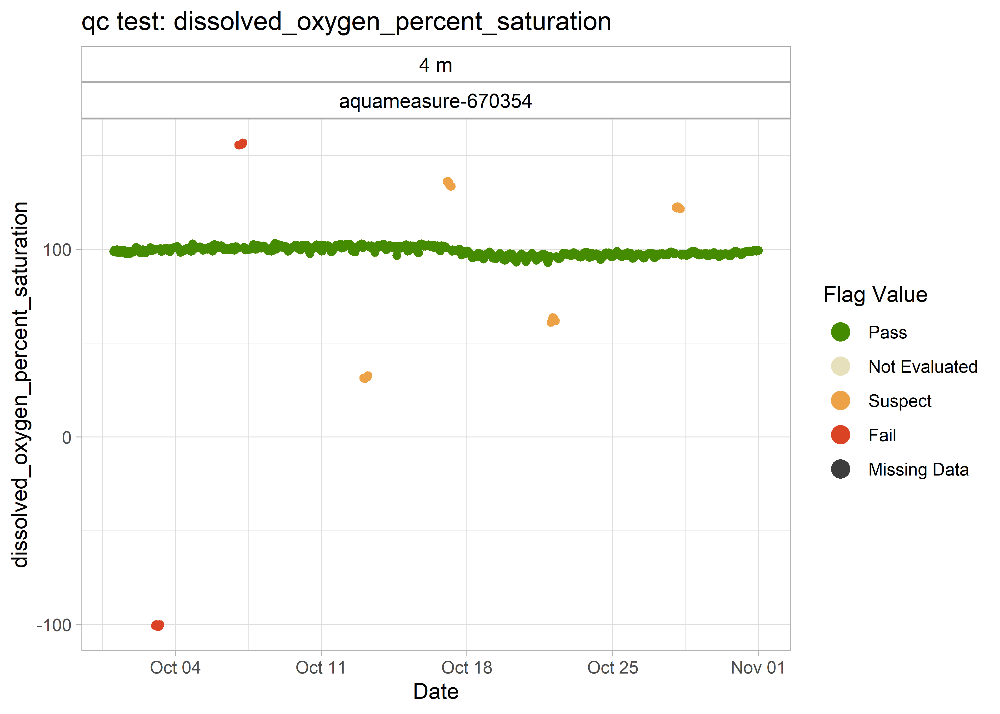

<!-- README.md is generated from README.Rmd. Please edit that file -->

# qaqcmar


<!-- badges: start -->

[](https://github.com/dempsey-CMAR/qaqcmar/actions/workflows/R-CMD-check.yaml)
<!-- badges: end -->

The goal of qaqcmar is to …

## Installation

You can install the development version of qaqcmar from
[GitHub](https://github.com/) with:

``` r
# install.packages("devtools")
devtools::install_github("dempsey-CMAR/qaqcmar")
```

## Example

This is a basic example which shows you how to solve a common problem:

``` r
library(qaqcmar)
library(sensorstrings)

library(dplyr)
library(lubridate)
```

### Example Sensor String Data

``` r
# read in example data
path <- system.file("testdata", package = "qaqcmar")

dat <- read.csv(paste0(path, "/example_data.csv")) %>% 
  select(
    sensor, timestamp_utc, 
    contains(c("depth", "temperature", "salinity", "dissolved_oxygen"))
  ) %>% 
  mutate(timestamp_utc = as_datetime(timestamp_utc))

kable(dat[1:10, ])
```

<table>
<thead>
<tr>
<th style="text-align:left;">
sensor
</th>
<th style="text-align:left;">
timestamp_utc
</th>
<th style="text-align:right;">
sensor_depth_at_low_tide_m
</th>
<th style="text-align:right;">
sensor_depth_measured_m
</th>
<th style="text-align:right;">
temperature_degree_C
</th>
<th style="text-align:right;">
salinity_psu
</th>
<th style="text-align:right;">
dissolved_oxygen_mg_per_L
</th>
<th style="text-align:right;">
dissolved_oxygen_percent_saturation
</th>
</tr>
</thead>
<tbody>
<tr>
<td style="text-align:left;">
HOBO Pro V2-10755220
</td>
<td style="text-align:left;">
2019-05-29 18:00:00
</td>
<td style="text-align:right;">
2
</td>
<td style="text-align:right;">
NA
</td>
<td style="text-align:right;">
12.243
</td>
<td style="text-align:right;">
NA
</td>
<td style="text-align:right;">
NA
</td>
<td style="text-align:right;">
NA
</td>
</tr>
<tr>
<td style="text-align:left;">
HOBO Pro V2-10755220
</td>
<td style="text-align:left;">
2019-05-30 19:00:00
</td>
<td style="text-align:right;">
2
</td>
<td style="text-align:right;">
NA
</td>
<td style="text-align:right;">
7.870
</td>
<td style="text-align:right;">
NA
</td>
<td style="text-align:right;">
NA
</td>
<td style="text-align:right;">
NA
</td>
</tr>
<tr>
<td style="text-align:left;">
HOBO Pro V2-10755220
</td>
<td style="text-align:left;">
2019-05-30 20:00:00
</td>
<td style="text-align:right;">
2
</td>
<td style="text-align:right;">
NA
</td>
<td style="text-align:right;">
6.585
</td>
<td style="text-align:right;">
NA
</td>
<td style="text-align:right;">
NA
</td>
<td style="text-align:right;">
NA
</td>
</tr>
<tr>
<td style="text-align:left;">
HOBO Pro V2-10755220
</td>
<td style="text-align:left;">
2019-05-30 21:00:00
</td>
<td style="text-align:right;">
2
</td>
<td style="text-align:right;">
NA
</td>
<td style="text-align:right;">
6.661
</td>
<td style="text-align:right;">
NA
</td>
<td style="text-align:right;">
NA
</td>
<td style="text-align:right;">
NA
</td>
</tr>
<tr>
<td style="text-align:left;">
HOBO Pro V2-10755220
</td>
<td style="text-align:left;">
2019-05-30 22:00:00
</td>
<td style="text-align:right;">
2
</td>
<td style="text-align:right;">
NA
</td>
<td style="text-align:right;">
6.661
</td>
<td style="text-align:right;">
NA
</td>
<td style="text-align:right;">
NA
</td>
<td style="text-align:right;">
NA
</td>
</tr>
<tr>
<td style="text-align:left;">
HOBO Pro V2-10755220
</td>
<td style="text-align:left;">
2019-05-30 23:00:00
</td>
<td style="text-align:right;">
2
</td>
<td style="text-align:right;">
NA
</td>
<td style="text-align:right;">
7.293
</td>
<td style="text-align:right;">
NA
</td>
<td style="text-align:right;">
NA
</td>
<td style="text-align:right;">
NA
</td>
</tr>
<tr>
<td style="text-align:left;">
HOBO Pro V2-10755220
</td>
<td style="text-align:left;">
2019-05-31 00:00:00
</td>
<td style="text-align:right;">
2
</td>
<td style="text-align:right;">
NA
</td>
<td style="text-align:right;">
7.670
</td>
<td style="text-align:right;">
NA
</td>
<td style="text-align:right;">
NA
</td>
<td style="text-align:right;">
NA
</td>
</tr>
<tr>
<td style="text-align:left;">
HOBO Pro V2-10755220
</td>
<td style="text-align:left;">
2019-10-18 10:00:00
</td>
<td style="text-align:right;">
2
</td>
<td style="text-align:right;">
NA
</td>
<td style="text-align:right;">
11.929
</td>
<td style="text-align:right;">
NA
</td>
<td style="text-align:right;">
NA
</td>
<td style="text-align:right;">
NA
</td>
</tr>
<tr>
<td style="text-align:left;">
HOBO Pro V2-10755220
</td>
<td style="text-align:left;">
2019-10-18 11:00:00
</td>
<td style="text-align:right;">
2
</td>
<td style="text-align:right;">
NA
</td>
<td style="text-align:right;">
11.904
</td>
<td style="text-align:right;">
NA
</td>
<td style="text-align:right;">
NA
</td>
<td style="text-align:right;">
NA
</td>
</tr>
<tr>
<td style="text-align:left;">
HOBO Pro V2-10755220
</td>
<td style="text-align:left;">
2019-10-18 12:00:00
</td>
<td style="text-align:right;">
2
</td>
<td style="text-align:right;">
NA
</td>
<td style="text-align:right;">
11.904
</td>
<td style="text-align:right;">
NA
</td>
<td style="text-align:right;">
NA
</td>
<td style="text-align:right;">
NA
</td>
</tr>
</tbody>
</table>

``` r
ss_plot_variables_at_depth(dat)
```


### Apply QC flags

#### Gross Range Test

Inspect the default gross range threshold values for each variable and
sensor:

``` r
kable(threshold_tables$grossrange_table)
```

<table>
<thead>
<tr>
<th style="text-align:left;">
variable
</th>
<th style="text-align:left;">
sensor_make
</th>
<th style="text-align:right;">
sensor_min
</th>
<th style="text-align:right;">
sensor_max
</th>
<th style="text-align:right;">
user_min
</th>
<th style="text-align:right;">
user_max
</th>
</tr>
</thead>
<tbody>
<tr>
<td style="text-align:left;">
dissolved_oxygen_mg_per_L
</td>
<td style="text-align:left;">
hobo
</td>
<td style="text-align:right;">
0
</td>
<td style="text-align:right;">
30
</td>
<td style="text-align:right;">
0
</td>
<td style="text-align:right;">
25
</td>
</tr>
<tr>
<td style="text-align:left;">
dissolved_oxygen_percent_saturation
</td>
<td style="text-align:left;">
aquameasure
</td>
<td style="text-align:right;">
0
</td>
<td style="text-align:right;">
150
</td>
<td style="text-align:right;">
50
</td>
<td style="text-align:right;">
130
</td>
</tr>
<tr>
<td style="text-align:left;">
salinity_psu
</td>
<td style="text-align:left;">
aquameasure
</td>
<td style="text-align:right;">
0
</td>
<td style="text-align:right;">
40
</td>
<td style="text-align:right;">
0
</td>
<td style="text-align:right;">
35
</td>
</tr>
<tr>
<td style="text-align:left;">
temperature_degree_C
</td>
<td style="text-align:left;">
aquameasure
</td>
<td style="text-align:right;">
-5
</td>
<td style="text-align:right;">
35
</td>
<td style="text-align:right;">
-3
</td>
<td style="text-align:right;">
25
</td>
</tr>
<tr>
<td style="text-align:left;">
temperature_degree_C
</td>
<td style="text-align:left;">
hobo
</td>
<td style="text-align:right;">
-40
</td>
<td style="text-align:right;">
70
</td>
<td style="text-align:right;">
-3
</td>
<td style="text-align:right;">
25
</td>
</tr>
<tr>
<td style="text-align:left;">
temperature_degree_C
</td>
<td style="text-align:left;">
vemco
</td>
<td style="text-align:right;">
-5
</td>
<td style="text-align:right;">
40
</td>
<td style="text-align:right;">
-3
</td>
<td style="text-align:right;">
25
</td>
</tr>
</tbody>
</table>

Apply test:

``` r
dat_gr <- qc_test_grossrange(dat)

kable(dat_gr[1:10, ])
```

<table>
<thead>
<tr>
<th style="text-align:left;">
sensor
</th>
<th style="text-align:left;">
timestamp_utc
</th>
<th style="text-align:right;">
sensor_depth_at_low_tide_m
</th>
<th style="text-align:right;">
value_temperature_degree_C
</th>
<th style="text-align:right;">
value_dissolved_oxygen_percent_saturation
</th>
<th style="text-align:right;">
value_salinity_psu
</th>
<th style="text-align:right;">
value_sensor_depth_measured_m
</th>
<th style="text-align:right;">
value_dissolved_oxygen_mg_per_L
</th>
<th style="text-align:left;">
grossrange_flag_temperature_degree_C
</th>
<th style="text-align:left;">
grossrange_flag_dissolved_oxygen_percent_saturation
</th>
<th style="text-align:left;">
grossrange_flag_salinity_psu
</th>
<th style="text-align:left;">
grossrange_flag_sensor_depth_measured_m
</th>
<th style="text-align:left;">
grossrange_flag_dissolved_oxygen_mg_per_L
</th>
</tr>
</thead>
<tbody>
<tr>
<td style="text-align:left;">
HOBO Pro V2-10755220
</td>
<td style="text-align:left;">
2019-05-29 18:00:00
</td>
<td style="text-align:right;">
2
</td>
<td style="text-align:right;">
12.243
</td>
<td style="text-align:right;">
NA
</td>
<td style="text-align:right;">
NA
</td>
<td style="text-align:right;">
NA
</td>
<td style="text-align:right;">
NA
</td>
<td style="text-align:left;">
1
</td>
<td style="text-align:left;">
NA
</td>
<td style="text-align:left;">
NA
</td>
<td style="text-align:left;">
NA
</td>
<td style="text-align:left;">
NA
</td>
</tr>
<tr>
<td style="text-align:left;">
HOBO Pro V2-10755220
</td>
<td style="text-align:left;">
2019-05-30 19:00:00
</td>
<td style="text-align:right;">
2
</td>
<td style="text-align:right;">
7.870
</td>
<td style="text-align:right;">
NA
</td>
<td style="text-align:right;">
NA
</td>
<td style="text-align:right;">
NA
</td>
<td style="text-align:right;">
NA
</td>
<td style="text-align:left;">
1
</td>
<td style="text-align:left;">
NA
</td>
<td style="text-align:left;">
NA
</td>
<td style="text-align:left;">
NA
</td>
<td style="text-align:left;">
NA
</td>
</tr>
<tr>
<td style="text-align:left;">
HOBO Pro V2-10755220
</td>
<td style="text-align:left;">
2019-05-30 20:00:00
</td>
<td style="text-align:right;">
2
</td>
<td style="text-align:right;">
6.585
</td>
<td style="text-align:right;">
NA
</td>
<td style="text-align:right;">
NA
</td>
<td style="text-align:right;">
NA
</td>
<td style="text-align:right;">
NA
</td>
<td style="text-align:left;">
1
</td>
<td style="text-align:left;">
NA
</td>
<td style="text-align:left;">
NA
</td>
<td style="text-align:left;">
NA
</td>
<td style="text-align:left;">
NA
</td>
</tr>
<tr>
<td style="text-align:left;">
HOBO Pro V2-10755220
</td>
<td style="text-align:left;">
2019-05-30 21:00:00
</td>
<td style="text-align:right;">
2
</td>
<td style="text-align:right;">
6.661
</td>
<td style="text-align:right;">
NA
</td>
<td style="text-align:right;">
NA
</td>
<td style="text-align:right;">
NA
</td>
<td style="text-align:right;">
NA
</td>
<td style="text-align:left;">
1
</td>
<td style="text-align:left;">
NA
</td>
<td style="text-align:left;">
NA
</td>
<td style="text-align:left;">
NA
</td>
<td style="text-align:left;">
NA
</td>
</tr>
<tr>
<td style="text-align:left;">
HOBO Pro V2-10755220
</td>
<td style="text-align:left;">
2019-05-30 22:00:00
</td>
<td style="text-align:right;">
2
</td>
<td style="text-align:right;">
6.661
</td>
<td style="text-align:right;">
NA
</td>
<td style="text-align:right;">
NA
</td>
<td style="text-align:right;">
NA
</td>
<td style="text-align:right;">
NA
</td>
<td style="text-align:left;">
1
</td>
<td style="text-align:left;">
NA
</td>
<td style="text-align:left;">
NA
</td>
<td style="text-align:left;">
NA
</td>
<td style="text-align:left;">
NA
</td>
</tr>
<tr>
<td style="text-align:left;">
HOBO Pro V2-10755220
</td>
<td style="text-align:left;">
2019-05-30 23:00:00
</td>
<td style="text-align:right;">
2
</td>
<td style="text-align:right;">
7.293
</td>
<td style="text-align:right;">
NA
</td>
<td style="text-align:right;">
NA
</td>
<td style="text-align:right;">
NA
</td>
<td style="text-align:right;">
NA
</td>
<td style="text-align:left;">
1
</td>
<td style="text-align:left;">
NA
</td>
<td style="text-align:left;">
NA
</td>
<td style="text-align:left;">
NA
</td>
<td style="text-align:left;">
NA
</td>
</tr>
<tr>
<td style="text-align:left;">
HOBO Pro V2-10755220
</td>
<td style="text-align:left;">
2019-05-31 00:00:00
</td>
<td style="text-align:right;">
2
</td>
<td style="text-align:right;">
7.670
</td>
<td style="text-align:right;">
NA
</td>
<td style="text-align:right;">
NA
</td>
<td style="text-align:right;">
NA
</td>
<td style="text-align:right;">
NA
</td>
<td style="text-align:left;">
1
</td>
<td style="text-align:left;">
NA
</td>
<td style="text-align:left;">
NA
</td>
<td style="text-align:left;">
NA
</td>
<td style="text-align:left;">
NA
</td>
</tr>
<tr>
<td style="text-align:left;">
HOBO Pro V2-10755220
</td>
<td style="text-align:left;">
2019-10-18 10:00:00
</td>
<td style="text-align:right;">
2
</td>
<td style="text-align:right;">
11.929
</td>
<td style="text-align:right;">
NA
</td>
<td style="text-align:right;">
NA
</td>
<td style="text-align:right;">
NA
</td>
<td style="text-align:right;">
NA
</td>
<td style="text-align:left;">
1
</td>
<td style="text-align:left;">
NA
</td>
<td style="text-align:left;">
NA
</td>
<td style="text-align:left;">
NA
</td>
<td style="text-align:left;">
NA
</td>
</tr>
<tr>
<td style="text-align:left;">
HOBO Pro V2-10755220
</td>
<td style="text-align:left;">
2019-10-18 11:00:00
</td>
<td style="text-align:right;">
2
</td>
<td style="text-align:right;">
11.904
</td>
<td style="text-align:right;">
NA
</td>
<td style="text-align:right;">
NA
</td>
<td style="text-align:right;">
NA
</td>
<td style="text-align:right;">
NA
</td>
<td style="text-align:left;">
1
</td>
<td style="text-align:left;">
NA
</td>
<td style="text-align:left;">
NA
</td>
<td style="text-align:left;">
NA
</td>
<td style="text-align:left;">
NA
</td>
</tr>
<tr>
<td style="text-align:left;">
HOBO Pro V2-10755220
</td>
<td style="text-align:left;">
2019-10-18 12:00:00
</td>
<td style="text-align:right;">
2
</td>
<td style="text-align:right;">
11.904
</td>
<td style="text-align:right;">
NA
</td>
<td style="text-align:right;">
NA
</td>
<td style="text-align:right;">
NA
</td>
<td style="text-align:right;">
NA
</td>
<td style="text-align:left;">
1
</td>
<td style="text-align:left;">
NA
</td>
<td style="text-align:left;">
NA
</td>
<td style="text-align:left;">
NA
</td>
<td style="text-align:left;">
NA
</td>
</tr>
</tbody>
</table>

``` r
dat_gr <- dat_gr %>% 
  qc_pivot_longer(qc_tests = "grossrange")

kable(dat_gr[1:10, ])
```

<table>
<thead>
<tr>
<th style="text-align:left;">
sensor
</th>
<th style="text-align:left;">
timestamp_utc
</th>
<th style="text-align:right;">
sensor_depth_at_low_tide_m
</th>
<th style="text-align:left;">
variable
</th>
<th style="text-align:right;">
value
</th>
<th style="text-align:left;">
grossrange_flag_value
</th>
</tr>
</thead>
<tbody>
<tr>
<td style="text-align:left;">
HOBO Pro V2-10755220
</td>
<td style="text-align:left;">
2019-05-29 18:00:00
</td>
<td style="text-align:right;">
2
</td>
<td style="text-align:left;">
temperature_degree_C
</td>
<td style="text-align:right;">
12.243
</td>
<td style="text-align:left;">
1
</td>
</tr>
<tr>
<td style="text-align:left;">
HOBO Pro V2-10755220
</td>
<td style="text-align:left;">
2019-05-30 19:00:00
</td>
<td style="text-align:right;">
2
</td>
<td style="text-align:left;">
temperature_degree_C
</td>
<td style="text-align:right;">
7.870
</td>
<td style="text-align:left;">
1
</td>
</tr>
<tr>
<td style="text-align:left;">
HOBO Pro V2-10755220
</td>
<td style="text-align:left;">
2019-05-30 20:00:00
</td>
<td style="text-align:right;">
2
</td>
<td style="text-align:left;">
temperature_degree_C
</td>
<td style="text-align:right;">
6.585
</td>
<td style="text-align:left;">
1
</td>
</tr>
<tr>
<td style="text-align:left;">
HOBO Pro V2-10755220
</td>
<td style="text-align:left;">
2019-05-30 21:00:00
</td>
<td style="text-align:right;">
2
</td>
<td style="text-align:left;">
temperature_degree_C
</td>
<td style="text-align:right;">
6.661
</td>
<td style="text-align:left;">
1
</td>
</tr>
<tr>
<td style="text-align:left;">
HOBO Pro V2-10755220
</td>
<td style="text-align:left;">
2019-05-30 22:00:00
</td>
<td style="text-align:right;">
2
</td>
<td style="text-align:left;">
temperature_degree_C
</td>
<td style="text-align:right;">
6.661
</td>
<td style="text-align:left;">
1
</td>
</tr>
<tr>
<td style="text-align:left;">
HOBO Pro V2-10755220
</td>
<td style="text-align:left;">
2019-05-30 23:00:00
</td>
<td style="text-align:right;">
2
</td>
<td style="text-align:left;">
temperature_degree_C
</td>
<td style="text-align:right;">
7.293
</td>
<td style="text-align:left;">
1
</td>
</tr>
<tr>
<td style="text-align:left;">
HOBO Pro V2-10755220
</td>
<td style="text-align:left;">
2019-05-31 00:00:00
</td>
<td style="text-align:right;">
2
</td>
<td style="text-align:left;">
temperature_degree_C
</td>
<td style="text-align:right;">
7.670
</td>
<td style="text-align:left;">
1
</td>
</tr>
<tr>
<td style="text-align:left;">
HOBO Pro V2-10755220
</td>
<td style="text-align:left;">
2019-10-18 10:00:00
</td>
<td style="text-align:right;">
2
</td>
<td style="text-align:left;">
temperature_degree_C
</td>
<td style="text-align:right;">
11.929
</td>
<td style="text-align:left;">
1
</td>
</tr>
<tr>
<td style="text-align:left;">
HOBO Pro V2-10755220
</td>
<td style="text-align:left;">
2019-10-18 11:00:00
</td>
<td style="text-align:right;">
2
</td>
<td style="text-align:left;">
temperature_degree_C
</td>
<td style="text-align:right;">
11.904
</td>
<td style="text-align:left;">
1
</td>
</tr>
<tr>
<td style="text-align:left;">
HOBO Pro V2-10755220
</td>
<td style="text-align:left;">
2019-10-18 12:00:00
</td>
<td style="text-align:right;">
2
</td>
<td style="text-align:left;">
temperature_degree_C
</td>
<td style="text-align:right;">
11.904
</td>
<td style="text-align:left;">
1
</td>
</tr>
</tbody>
</table>

Plot flagged observations:

``` r
grossrange_plots <- qc_plot_flag_vars(dat_gr, qc_tests = "grossrange")

grossrange_plots
#> $temperature_degree_C
#> $temperature_degree_C$grossrange
```


    #> 
    #> 
    #> $dissolved_oxygen_percent_saturation
    #> $dissolved_oxygen_percent_saturation$grossrange


    #> 
    #> 
    #> $salinity_psu
    #> $salinity_psu$grossrange


    #> 
    #> 
    #> $sensor_depth_measured_m
    #> $sensor_depth_measured_m$grossrange


    #> 
    #> 
    #> $dissolved_oxygen_mg_per_L
    #> $dissolved_oxygen_mg_per_L$grossrange


#### Climatology Test

Inspect the default gross range threshold values for each variable and
season:

``` r
kable(threshold_tables$climatology_table)
```

<table>
<thead>
<tr>
<th style="text-align:left;">
variable
</th>
<th style="text-align:left;">
season
</th>
<th style="text-align:right;">
season_min
</th>
<th style="text-align:right;">
season_max
</th>
</tr>
</thead>
<tbody>
<tr>
<td style="text-align:left;">
dissolved_oxygen_mg_per_L
</td>
<td style="text-align:left;">
winter
</td>
<td style="text-align:right;">
2.0
</td>
<td style="text-align:right;">
15
</td>
</tr>
<tr>
<td style="text-align:left;">
dissolved_oxygen_mg_per_L
</td>
<td style="text-align:left;">
spring
</td>
<td style="text-align:right;">
5.0
</td>
<td style="text-align:right;">
20
</td>
</tr>
<tr>
<td style="text-align:left;">
dissolved_oxygen_mg_per_L
</td>
<td style="text-align:left;">
summer
</td>
<td style="text-align:right;">
10.0
</td>
<td style="text-align:right;">
20
</td>
</tr>
<tr>
<td style="text-align:left;">
dissolved_oxygen_mg_per_L
</td>
<td style="text-align:left;">
fall
</td>
<td style="text-align:right;">
2.0
</td>
<td style="text-align:right;">
15
</td>
</tr>
<tr>
<td style="text-align:left;">
dissolved_oxygen_percent_saturation
</td>
<td style="text-align:left;">
winter
</td>
<td style="text-align:right;">
70.0
</td>
<td style="text-align:right;">
120
</td>
</tr>
<tr>
<td style="text-align:left;">
dissolved_oxygen_percent_saturation
</td>
<td style="text-align:left;">
spring
</td>
<td style="text-align:right;">
70.0
</td>
<td style="text-align:right;">
130
</td>
</tr>
<tr>
<td style="text-align:left;">
dissolved_oxygen_percent_saturation
</td>
<td style="text-align:left;">
summer
</td>
<td style="text-align:right;">
70.0
</td>
<td style="text-align:right;">
130
</td>
</tr>
<tr>
<td style="text-align:left;">
dissolved_oxygen_percent_saturation
</td>
<td style="text-align:left;">
fall
</td>
<td style="text-align:right;">
70.0
</td>
<td style="text-align:right;">
120
</td>
</tr>
<tr>
<td style="text-align:left;">
salinity_psu
</td>
<td style="text-align:left;">
winter
</td>
<td style="text-align:right;">
0.0
</td>
<td style="text-align:right;">
40
</td>
</tr>
<tr>
<td style="text-align:left;">
salinity_psu
</td>
<td style="text-align:left;">
spring
</td>
<td style="text-align:right;">
0.0
</td>
<td style="text-align:right;">
40
</td>
</tr>
<tr>
<td style="text-align:left;">
salinity_psu
</td>
<td style="text-align:left;">
summer
</td>
<td style="text-align:right;">
0.0
</td>
<td style="text-align:right;">
40
</td>
</tr>
<tr>
<td style="text-align:left;">
salinity_psu
</td>
<td style="text-align:left;">
fall
</td>
<td style="text-align:right;">
0.0
</td>
<td style="text-align:right;">
40
</td>
</tr>
<tr>
<td style="text-align:left;">
temperature_degree_C
</td>
<td style="text-align:left;">
winter
</td>
<td style="text-align:right;">
-0.7
</td>
<td style="text-align:right;">
15
</td>
</tr>
<tr>
<td style="text-align:left;">
temperature_degree_C
</td>
<td style="text-align:left;">
spring
</td>
<td style="text-align:right;">
0.0
</td>
<td style="text-align:right;">
20
</td>
</tr>
<tr>
<td style="text-align:left;">
temperature_degree_C
</td>
<td style="text-align:left;">
summer
</td>
<td style="text-align:right;">
7.0
</td>
<td style="text-align:right;">
25
</td>
</tr>
<tr>
<td style="text-align:left;">
temperature_degree_C
</td>
<td style="text-align:left;">
fall
</td>
<td style="text-align:right;">
5.0
</td>
<td style="text-align:right;">
20
</td>
</tr>
</tbody>
</table>

Inspect default seasons:

``` r
kable(threshold_tables$seasons_table)
```

<table>
<thead>
<tr>
<th style="text-align:right;">
numeric_month
</th>
<th style="text-align:left;">
season
</th>
</tr>
</thead>
<tbody>
<tr>
<td style="text-align:right;">
1
</td>
<td style="text-align:left;">
winter
</td>
</tr>
<tr>
<td style="text-align:right;">
2
</td>
<td style="text-align:left;">
winter
</td>
</tr>
<tr>
<td style="text-align:right;">
3
</td>
<td style="text-align:left;">
winter
</td>
</tr>
<tr>
<td style="text-align:right;">
4
</td>
<td style="text-align:left;">
spring
</td>
</tr>
<tr>
<td style="text-align:right;">
5
</td>
<td style="text-align:left;">
spring
</td>
</tr>
<tr>
<td style="text-align:right;">
6
</td>
<td style="text-align:left;">
spring
</td>
</tr>
<tr>
<td style="text-align:right;">
7
</td>
<td style="text-align:left;">
summer
</td>
</tr>
<tr>
<td style="text-align:right;">
8
</td>
<td style="text-align:left;">
summer
</td>
</tr>
<tr>
<td style="text-align:right;">
9
</td>
<td style="text-align:left;">
summer
</td>
</tr>
<tr>
<td style="text-align:right;">
10
</td>
<td style="text-align:left;">
fall
</td>
</tr>
<tr>
<td style="text-align:right;">
11
</td>
<td style="text-align:left;">
fall
</td>
</tr>
<tr>
<td style="text-align:right;">
12
</td>
<td style="text-align:left;">
fall
</td>
</tr>
</tbody>
</table>

Apply test:

``` r
dat_cl <- qc_test_climatology(dat)

kable(dat_cl[1:10, ])
```

<table>
<thead>
<tr>
<th style="text-align:left;">
sensor
</th>
<th style="text-align:left;">
timestamp_utc
</th>
<th style="text-align:right;">
sensor_depth_at_low_tide_m
</th>
<th style="text-align:right;">
value_temperature_degree_C
</th>
<th style="text-align:right;">
value_dissolved_oxygen_percent_saturation
</th>
<th style="text-align:right;">
value_salinity_psu
</th>
<th style="text-align:right;">
value_sensor_depth_measured_m
</th>
<th style="text-align:right;">
value_dissolved_oxygen_mg_per_L
</th>
<th style="text-align:left;">
climatology_flag_temperature_degree_C
</th>
<th style="text-align:left;">
climatology_flag_dissolved_oxygen_percent_saturation
</th>
<th style="text-align:left;">
climatology_flag_salinity_psu
</th>
<th style="text-align:left;">
climatology_flag_sensor_depth_measured_m
</th>
<th style="text-align:left;">
climatology_flag_dissolved_oxygen_mg_per_L
</th>
</tr>
</thead>
<tbody>
<tr>
<td style="text-align:left;">
HOBO Pro V2-10755220
</td>
<td style="text-align:left;">
2019-05-29 18:00:00
</td>
<td style="text-align:right;">
2
</td>
<td style="text-align:right;">
12.243
</td>
<td style="text-align:right;">
NA
</td>
<td style="text-align:right;">
NA
</td>
<td style="text-align:right;">
NA
</td>
<td style="text-align:right;">
NA
</td>
<td style="text-align:left;">
1
</td>
<td style="text-align:left;">
NA
</td>
<td style="text-align:left;">
NA
</td>
<td style="text-align:left;">
NA
</td>
<td style="text-align:left;">
NA
</td>
</tr>
<tr>
<td style="text-align:left;">
HOBO Pro V2-10755220
</td>
<td style="text-align:left;">
2019-05-30 19:00:00
</td>
<td style="text-align:right;">
2
</td>
<td style="text-align:right;">
7.870
</td>
<td style="text-align:right;">
NA
</td>
<td style="text-align:right;">
NA
</td>
<td style="text-align:right;">
NA
</td>
<td style="text-align:right;">
NA
</td>
<td style="text-align:left;">
1
</td>
<td style="text-align:left;">
NA
</td>
<td style="text-align:left;">
NA
</td>
<td style="text-align:left;">
NA
</td>
<td style="text-align:left;">
NA
</td>
</tr>
<tr>
<td style="text-align:left;">
HOBO Pro V2-10755220
</td>
<td style="text-align:left;">
2019-05-30 20:00:00
</td>
<td style="text-align:right;">
2
</td>
<td style="text-align:right;">
6.585
</td>
<td style="text-align:right;">
NA
</td>
<td style="text-align:right;">
NA
</td>
<td style="text-align:right;">
NA
</td>
<td style="text-align:right;">
NA
</td>
<td style="text-align:left;">
1
</td>
<td style="text-align:left;">
NA
</td>
<td style="text-align:left;">
NA
</td>
<td style="text-align:left;">
NA
</td>
<td style="text-align:left;">
NA
</td>
</tr>
<tr>
<td style="text-align:left;">
HOBO Pro V2-10755220
</td>
<td style="text-align:left;">
2019-05-30 21:00:00
</td>
<td style="text-align:right;">
2
</td>
<td style="text-align:right;">
6.661
</td>
<td style="text-align:right;">
NA
</td>
<td style="text-align:right;">
NA
</td>
<td style="text-align:right;">
NA
</td>
<td style="text-align:right;">
NA
</td>
<td style="text-align:left;">
1
</td>
<td style="text-align:left;">
NA
</td>
<td style="text-align:left;">
NA
</td>
<td style="text-align:left;">
NA
</td>
<td style="text-align:left;">
NA
</td>
</tr>
<tr>
<td style="text-align:left;">
HOBO Pro V2-10755220
</td>
<td style="text-align:left;">
2019-05-30 22:00:00
</td>
<td style="text-align:right;">
2
</td>
<td style="text-align:right;">
6.661
</td>
<td style="text-align:right;">
NA
</td>
<td style="text-align:right;">
NA
</td>
<td style="text-align:right;">
NA
</td>
<td style="text-align:right;">
NA
</td>
<td style="text-align:left;">
1
</td>
<td style="text-align:left;">
NA
</td>
<td style="text-align:left;">
NA
</td>
<td style="text-align:left;">
NA
</td>
<td style="text-align:left;">
NA
</td>
</tr>
<tr>
<td style="text-align:left;">
HOBO Pro V2-10755220
</td>
<td style="text-align:left;">
2019-05-30 23:00:00
</td>
<td style="text-align:right;">
2
</td>
<td style="text-align:right;">
7.293
</td>
<td style="text-align:right;">
NA
</td>
<td style="text-align:right;">
NA
</td>
<td style="text-align:right;">
NA
</td>
<td style="text-align:right;">
NA
</td>
<td style="text-align:left;">
1
</td>
<td style="text-align:left;">
NA
</td>
<td style="text-align:left;">
NA
</td>
<td style="text-align:left;">
NA
</td>
<td style="text-align:left;">
NA
</td>
</tr>
<tr>
<td style="text-align:left;">
HOBO Pro V2-10755220
</td>
<td style="text-align:left;">
2019-05-31 00:00:00
</td>
<td style="text-align:right;">
2
</td>
<td style="text-align:right;">
7.670
</td>
<td style="text-align:right;">
NA
</td>
<td style="text-align:right;">
NA
</td>
<td style="text-align:right;">
NA
</td>
<td style="text-align:right;">
NA
</td>
<td style="text-align:left;">
1
</td>
<td style="text-align:left;">
NA
</td>
<td style="text-align:left;">
NA
</td>
<td style="text-align:left;">
NA
</td>
<td style="text-align:left;">
NA
</td>
</tr>
<tr>
<td style="text-align:left;">
HOBO Pro V2-10755220
</td>
<td style="text-align:left;">
2019-10-18 10:00:00
</td>
<td style="text-align:right;">
2
</td>
<td style="text-align:right;">
11.929
</td>
<td style="text-align:right;">
NA
</td>
<td style="text-align:right;">
NA
</td>
<td style="text-align:right;">
NA
</td>
<td style="text-align:right;">
NA
</td>
<td style="text-align:left;">
1
</td>
<td style="text-align:left;">
NA
</td>
<td style="text-align:left;">
NA
</td>
<td style="text-align:left;">
NA
</td>
<td style="text-align:left;">
NA
</td>
</tr>
<tr>
<td style="text-align:left;">
HOBO Pro V2-10755220
</td>
<td style="text-align:left;">
2019-10-18 11:00:00
</td>
<td style="text-align:right;">
2
</td>
<td style="text-align:right;">
11.904
</td>
<td style="text-align:right;">
NA
</td>
<td style="text-align:right;">
NA
</td>
<td style="text-align:right;">
NA
</td>
<td style="text-align:right;">
NA
</td>
<td style="text-align:left;">
1
</td>
<td style="text-align:left;">
NA
</td>
<td style="text-align:left;">
NA
</td>
<td style="text-align:left;">
NA
</td>
<td style="text-align:left;">
NA
</td>
</tr>
<tr>
<td style="text-align:left;">
HOBO Pro V2-10755220
</td>
<td style="text-align:left;">
2019-10-18 12:00:00
</td>
<td style="text-align:right;">
2
</td>
<td style="text-align:right;">
11.904
</td>
<td style="text-align:right;">
NA
</td>
<td style="text-align:right;">
NA
</td>
<td style="text-align:right;">
NA
</td>
<td style="text-align:right;">
NA
</td>
<td style="text-align:left;">
1
</td>
<td style="text-align:left;">
NA
</td>
<td style="text-align:left;">
NA
</td>
<td style="text-align:left;">
NA
</td>
<td style="text-align:left;">
NA
</td>
</tr>
</tbody>
</table>

``` r
dat_cl <- dat_cl %>% 
  qc_pivot_longer(qc_tests = "climatology")

kable(dat_gr[1:10, ])
```

<table>
<thead>
<tr>
<th style="text-align:left;">
sensor
</th>
<th style="text-align:left;">
timestamp_utc
</th>
<th style="text-align:right;">
sensor_depth_at_low_tide_m
</th>
<th style="text-align:left;">
variable
</th>
<th style="text-align:right;">
value
</th>
<th style="text-align:left;">
grossrange_flag_value
</th>
</tr>
</thead>
<tbody>
<tr>
<td style="text-align:left;">
HOBO Pro V2-10755220
</td>
<td style="text-align:left;">
2019-05-29 18:00:00
</td>
<td style="text-align:right;">
2
</td>
<td style="text-align:left;">
temperature_degree_C
</td>
<td style="text-align:right;">
12.243
</td>
<td style="text-align:left;">
1
</td>
</tr>
<tr>
<td style="text-align:left;">
HOBO Pro V2-10755220
</td>
<td style="text-align:left;">
2019-05-30 19:00:00
</td>
<td style="text-align:right;">
2
</td>
<td style="text-align:left;">
temperature_degree_C
</td>
<td style="text-align:right;">
7.870
</td>
<td style="text-align:left;">
1
</td>
</tr>
<tr>
<td style="text-align:left;">
HOBO Pro V2-10755220
</td>
<td style="text-align:left;">
2019-05-30 20:00:00
</td>
<td style="text-align:right;">
2
</td>
<td style="text-align:left;">
temperature_degree_C
</td>
<td style="text-align:right;">
6.585
</td>
<td style="text-align:left;">
1
</td>
</tr>
<tr>
<td style="text-align:left;">
HOBO Pro V2-10755220
</td>
<td style="text-align:left;">
2019-05-30 21:00:00
</td>
<td style="text-align:right;">
2
</td>
<td style="text-align:left;">
temperature_degree_C
</td>
<td style="text-align:right;">
6.661
</td>
<td style="text-align:left;">
1
</td>
</tr>
<tr>
<td style="text-align:left;">
HOBO Pro V2-10755220
</td>
<td style="text-align:left;">
2019-05-30 22:00:00
</td>
<td style="text-align:right;">
2
</td>
<td style="text-align:left;">
temperature_degree_C
</td>
<td style="text-align:right;">
6.661
</td>
<td style="text-align:left;">
1
</td>
</tr>
<tr>
<td style="text-align:left;">
HOBO Pro V2-10755220
</td>
<td style="text-align:left;">
2019-05-30 23:00:00
</td>
<td style="text-align:right;">
2
</td>
<td style="text-align:left;">
temperature_degree_C
</td>
<td style="text-align:right;">
7.293
</td>
<td style="text-align:left;">
1
</td>
</tr>
<tr>
<td style="text-align:left;">
HOBO Pro V2-10755220
</td>
<td style="text-align:left;">
2019-05-31 00:00:00
</td>
<td style="text-align:right;">
2
</td>
<td style="text-align:left;">
temperature_degree_C
</td>
<td style="text-align:right;">
7.670
</td>
<td style="text-align:left;">
1
</td>
</tr>
<tr>
<td style="text-align:left;">
HOBO Pro V2-10755220
</td>
<td style="text-align:left;">
2019-10-18 10:00:00
</td>
<td style="text-align:right;">
2
</td>
<td style="text-align:left;">
temperature_degree_C
</td>
<td style="text-align:right;">
11.929
</td>
<td style="text-align:left;">
1
</td>
</tr>
<tr>
<td style="text-align:left;">
HOBO Pro V2-10755220
</td>
<td style="text-align:left;">
2019-10-18 11:00:00
</td>
<td style="text-align:right;">
2
</td>
<td style="text-align:left;">
temperature_degree_C
</td>
<td style="text-align:right;">
11.904
</td>
<td style="text-align:left;">
1
</td>
</tr>
<tr>
<td style="text-align:left;">
HOBO Pro V2-10755220
</td>
<td style="text-align:left;">
2019-10-18 12:00:00
</td>
<td style="text-align:right;">
2
</td>
<td style="text-align:left;">
temperature_degree_C
</td>
<td style="text-align:right;">
11.904
</td>
<td style="text-align:left;">
1
</td>
</tr>
</tbody>
</table>

Plot flagged observations:

``` r
climatology_plots <- qc_plot_flag_vars(dat_cl, qc_tests = "climatology")

climatology_plots
#> $temperature_degree_C
#> $temperature_degree_C$climatology
```


    #> 
    #> 
    #> $dissolved_oxygen_percent_saturation
    #> $dissolved_oxygen_percent_saturation$climatology



    #> 
    #> 
    #> $salinity_psu
    #> $salinity_psu$climatology



    #> 
    #> 
    #> $sensor_depth_measured_m
    #> $sensor_depth_measured_m$climatology


    #> 
    #> 
    #> $dissolved_oxygen_mg_per_L
    #> $dissolved_oxygen_mg_per_L$climatology


#### All Tests

``` r
dat_qc <- dat %>% 
  qc_test_all() %>% 
  qc_pivot_longer()
#> Joining, by = c("sensor", "timestamp_utc", "sensor_depth_at_low_tide_m",
#> "value_temperature_degree_C", "value_dissolved_oxygen_percent_saturation",
#> "value_salinity_psu", "value_sensor_depth_measured_m",
#> "value_dissolved_oxygen_mg_per_L")

kable(dat_qc[1:10, ])
```

<table>
<thead>
<tr>
<th style="text-align:left;">
sensor
</th>
<th style="text-align:left;">
timestamp_utc
</th>
<th style="text-align:right;">
sensor_depth_at_low_tide_m
</th>
<th style="text-align:left;">
variable
</th>
<th style="text-align:right;">
value
</th>
<th style="text-align:left;">
climatology_flag_value
</th>
<th style="text-align:left;">
grossrange_flag_value
</th>
</tr>
</thead>
<tbody>
<tr>
<td style="text-align:left;">
HOBO Pro V2-10755220
</td>
<td style="text-align:left;">
2019-05-29 18:00:00
</td>
<td style="text-align:right;">
2
</td>
<td style="text-align:left;">
temperature_degree_C
</td>
<td style="text-align:right;">
12.243
</td>
<td style="text-align:left;">
1
</td>
<td style="text-align:left;">
1
</td>
</tr>
<tr>
<td style="text-align:left;">
HOBO Pro V2-10755220
</td>
<td style="text-align:left;">
2019-05-30 19:00:00
</td>
<td style="text-align:right;">
2
</td>
<td style="text-align:left;">
temperature_degree_C
</td>
<td style="text-align:right;">
7.870
</td>
<td style="text-align:left;">
1
</td>
<td style="text-align:left;">
1
</td>
</tr>
<tr>
<td style="text-align:left;">
HOBO Pro V2-10755220
</td>
<td style="text-align:left;">
2019-05-30 20:00:00
</td>
<td style="text-align:right;">
2
</td>
<td style="text-align:left;">
temperature_degree_C
</td>
<td style="text-align:right;">
6.585
</td>
<td style="text-align:left;">
1
</td>
<td style="text-align:left;">
1
</td>
</tr>
<tr>
<td style="text-align:left;">
HOBO Pro V2-10755220
</td>
<td style="text-align:left;">
2019-05-30 21:00:00
</td>
<td style="text-align:right;">
2
</td>
<td style="text-align:left;">
temperature_degree_C
</td>
<td style="text-align:right;">
6.661
</td>
<td style="text-align:left;">
1
</td>
<td style="text-align:left;">
1
</td>
</tr>
<tr>
<td style="text-align:left;">
HOBO Pro V2-10755220
</td>
<td style="text-align:left;">
2019-05-30 22:00:00
</td>
<td style="text-align:right;">
2
</td>
<td style="text-align:left;">
temperature_degree_C
</td>
<td style="text-align:right;">
6.661
</td>
<td style="text-align:left;">
1
</td>
<td style="text-align:left;">
1
</td>
</tr>
<tr>
<td style="text-align:left;">
HOBO Pro V2-10755220
</td>
<td style="text-align:left;">
2019-05-30 23:00:00
</td>
<td style="text-align:right;">
2
</td>
<td style="text-align:left;">
temperature_degree_C
</td>
<td style="text-align:right;">
7.293
</td>
<td style="text-align:left;">
1
</td>
<td style="text-align:left;">
1
</td>
</tr>
<tr>
<td style="text-align:left;">
HOBO Pro V2-10755220
</td>
<td style="text-align:left;">
2019-05-31 00:00:00
</td>
<td style="text-align:right;">
2
</td>
<td style="text-align:left;">
temperature_degree_C
</td>
<td style="text-align:right;">
7.670
</td>
<td style="text-align:left;">
1
</td>
<td style="text-align:left;">
1
</td>
</tr>
<tr>
<td style="text-align:left;">
HOBO Pro V2-10755220
</td>
<td style="text-align:left;">
2019-10-18 10:00:00
</td>
<td style="text-align:right;">
2
</td>
<td style="text-align:left;">
temperature_degree_C
</td>
<td style="text-align:right;">
11.929
</td>
<td style="text-align:left;">
1
</td>
<td style="text-align:left;">
1
</td>
</tr>
<tr>
<td style="text-align:left;">
HOBO Pro V2-10755220
</td>
<td style="text-align:left;">
2019-10-18 11:00:00
</td>
<td style="text-align:right;">
2
</td>
<td style="text-align:left;">
temperature_degree_C
</td>
<td style="text-align:right;">
11.904
</td>
<td style="text-align:left;">
1
</td>
<td style="text-align:left;">
1
</td>
</tr>
<tr>
<td style="text-align:left;">
HOBO Pro V2-10755220
</td>
<td style="text-align:left;">
2019-10-18 12:00:00
</td>
<td style="text-align:right;">
2
</td>
<td style="text-align:left;">
temperature_degree_C
</td>
<td style="text-align:right;">
11.904
</td>
<td style="text-align:left;">
1
</td>
<td style="text-align:left;">
1
</td>
</tr>
</tbody>
</table>

Plot flagged observations:

``` r
qc_plots <- qc_plot_flag_vars(dat_qc)

qc_plots
#> $temperature_degree_C
#> $temperature_degree_C$climatology
```


    #> 
    #> $temperature_degree_C$grossrange


    #> 
    #> 
    #> $dissolved_oxygen_percent_saturation
    #> $dissolved_oxygen_percent_saturation$climatology


    #> 
    #> $dissolved_oxygen_percent_saturation$grossrange


    #> 
    #> 
    #> $salinity_psu
    #> $salinity_psu$climatology


    #> 
    #> $salinity_psu$grossrange


    #> 
    #> 
    #> $sensor_depth_measured_m
    #> $sensor_depth_measured_m$climatology


    #> 
    #> $sensor_depth_measured_m$grossrange


    #> 
    #> 
    #> $dissolved_oxygen_mg_per_L
    #> $dissolved_oxygen_mg_per_L$climatology


    #> 
    #> $dissolved_oxygen_mg_per_L$grossrange


