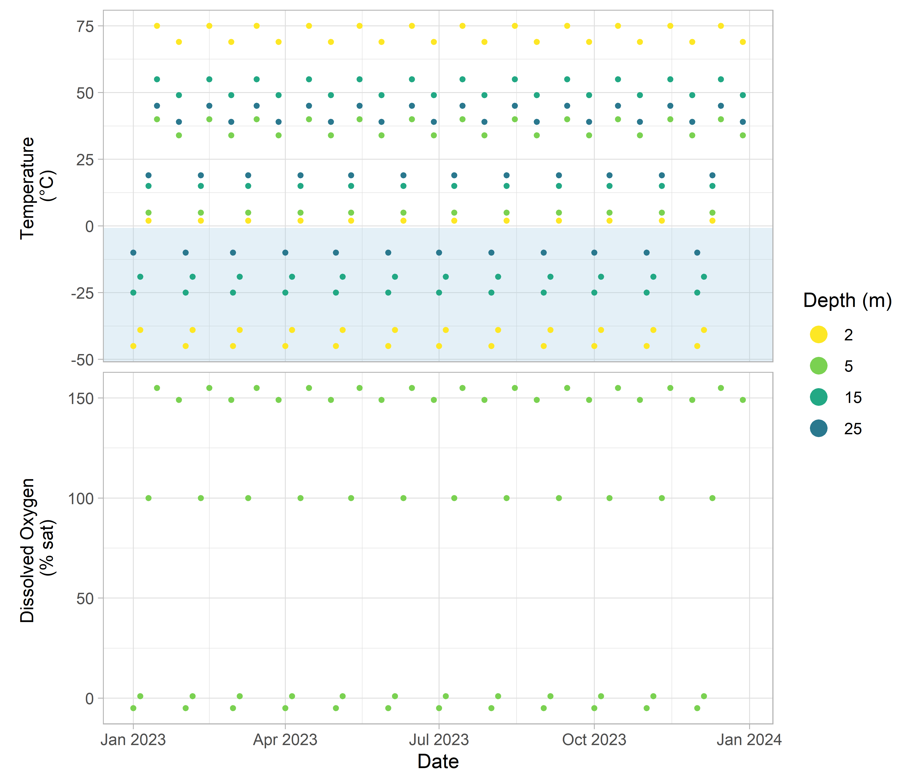

<!-- README.md is generated from README.Rmd. Please edit that file -->

# qaqcmar


<!-- badges: start -->

[](https://www.gnu.org/licenses/gpl-3.0)
[](https://github.com/dempsey-cmar/qaqcmar)
[](https://www.codefactor.io/repository/github/dempsey-cmar/qaqcmar)
[](https://github.com/dempsey-CMAR/qaqcmar/actions/workflows/R-CMD-check.yaml)
<!-- badges: end -->

`qaqcmar` applies quality control flags to Water Quality data collected
through the Centre for Marine Applied Research’s (CMAR) Coastal
Monitoring Program.

## Installation

You can install the development version of `qaqcmar` from
[GitHub](https://github.com/) with:

``` r
# install.packages("devtools")
devtools::install_github("dempsey-CMAR/qaqcmar")
```

## Background

### Coastal Monitoring Program

The Centre for Marine Applied Research ([CMAR](https://cmar.ca/))
coordinates an extensive [Coastal Monitoring
Program](https://cmar.ca/coastal-monitoring-program/) to measure
[Essential Ocean
Variables](https://www.goosocean.org/index.php?option=com_content&view=article&id=14&Itemid=114)
from around the coast of Nova Scotia, Canada. There are three main
branches of the program: *Water Quality*, *Currents*, and *Waves*.
Summary reports and full datasets for each branch can be viewed and
downloaded from several sources, as outlined in the [CMAR Report & Data
Access Cheat
Sheet](https://cmar.ca/wp-content/uploads/sites/22/2024/07/Report-Data-Access-2024-07-30.pdf).

### Quality Assurance and Quality Control

CMAR applies Quality Assurance (QA) and Quality Control (QC) processes
to support the delivery of high quality data (Bushnell et al, 2019). QA
processes are typically completed prior to sensor deployment (e.g.,
sensor calibration and validation), and are documented in a series of
Standard Operating Procedures.

Quality Control processes (e.g., automated data flags, manual review)
are completed for each deployment after the data have been collected and
compiled. CMAR has adapted the QARTOD (Quality Assurance / Quality
Control of Real-Time Oceanographic Data) flagging scheme and associated
tests. QARTOD provides a relatively simple yet informative rating scale,
and is very well documented. QARTOD manuals provide codeable
instructions for implementing recommended QC tests. QARTOD has been
adopted by oceanographic organizations around the world, including the
US Integrated Ocean Observing System (IOOS).

For more information on the Quality Control tests and thresholds, visit
the [CMAR Data Governance
Website](https://dempsey-cmar.github.io/cmp-data-governance/pages/cmp_about.html).

`qaqcmar` automates assigning flags to each observation based on QARTOD
recommendations and CMAR modifications.

## Example

``` r
library(ggplot2)
#> Warning: package 'ggplot2' was built under R version 4.2.3
library(qaqcmar)
library(sensorstrings)
library(dplyr)
#> Warning: package 'dplyr' was built under R version 4.2.3
library(kableExtra)
#> Warning: package 'kableExtra' was built under R version 4.2.3
library(lubridate)
```

### Example Sensor String Data

Consider simulated Water Quality data from January 1 to December
2023.(Note: this data was simulated to illustrate quality control
processes and does not reflect expected profiles.)

``` r
# read in example data
path <- system.file("testdata", package = "qaqcmar")

dat <- readRDS(paste0(path, "/test_data_grossrange.RDS")) 

kable(dat[1:5, ])
```

| county    | station     | deployment_range           | sensor_type | sensor_serial_number | sensor_depth_at_low_tide_m | timestamp_utc | dissolved_oxygen_percent_saturation | temperature_degree_c |
|:----------|:------------|:---------------------------|:------------|:---------------------|---------------------------:|:--------------|------------------------------------:|---------------------:|
| Lunenburg | White Tower | 2023-Jan-01 to 2023-Dec-28 | aquameasure | 123                  |                          5 | 2023-01-01    |                                  -5 |                  -10 |
| Lunenburg | White Tower | 2023-Jan-01 to 2023-Dec-28 | aquameasure | 123                  |                          5 | 2023-02-01    |                                  -5 |                  -10 |
| Lunenburg | White Tower | 2023-Jan-01 to 2023-Dec-28 | aquameasure | 123                  |                          5 | 2023-03-01    |                                  -5 |                  -10 |
| Lunenburg | White Tower | 2023-Jan-01 to 2023-Dec-28 | aquameasure | 123                  |                          5 | 2023-04-01    |                                  -5 |                  -10 |
| Lunenburg | White Tower | 2023-Jan-01 to 2023-Dec-28 | aquameasure | 123                  |                          5 | 2023-05-01    |                                  -5 |                  -10 |

``` r
ss_ggplot_variables(dat) + geom_point(size = 1)
```



### Apply QC flags

`qaqcmar` includes a separate function for each QC test. For example,
`qc_test_grossrange()` applies the gross range test by adding a a
`grossrange_flag_**` column for each variable in `dat`.

#### Gross Range Test

Apply test:

``` r
dat_gr <- qc_test_grossrange(dat, county = "Lunenburg")

kable(dat_gr[1:5, ])
```

| county    | station     | deployment_range           | sensor_type | sensor_serial_number | sensor_depth_at_low_tide_m | timestamp_utc | dissolved_oxygen_percent_saturation | temperature_degree_c | grossrange_flag_dissolved_oxygen_percent_saturation | grossrange_flag_temperature_degree_c |
|:----------|:------------|:---------------------------|:------------|:---------------------|---------------------------:|:--------------|------------------------------------:|---------------------:|:----------------------------------------------------|:-------------------------------------|
| Lunenburg | White Tower | 2023-Jan-01 to 2023-Dec-28 | aquameasure | 123                  |                          5 | 2023-01-01    |                                  -5 |                  -10 | 4                                                   | 4                                    |
| Lunenburg | White Tower | 2023-Jan-01 to 2023-Dec-28 | aquameasure | 123                  |                          5 | 2023-02-01    |                                  -5 |                  -10 | 4                                                   | 4                                    |
| Lunenburg | White Tower | 2023-Jan-01 to 2023-Dec-28 | aquameasure | 123                  |                          5 | 2023-03-01    |                                  -5 |                  -10 | 4                                                   | 4                                    |
| Lunenburg | White Tower | 2023-Jan-01 to 2023-Dec-28 | aquameasure | 123                  |                          5 | 2023-04-01    |                                  -5 |                  -10 | 4                                                   | 4                                    |
| Lunenburg | White Tower | 2023-Jan-01 to 2023-Dec-28 | aquameasure | 123                  |                          5 | 2023-05-01    |                                  -5 |                  -10 | 4                                                   | 4                                    |

The flagged data can be plotted with `qc_plot_flags()`, specifying
argument `qc_tests = "grossrange"`.

``` r
dat_gr %>% 
  qc_pivot_longer(qc_tests = "grossrange") %>% 
  qc_plot_flags( qc_tests = "grossrange", ncol = 2)
#> $dissolved_oxygen_percent_saturation
#> $dissolved_oxygen_percent_saturation$grossrange
```


    #> 
    #> 
    #> $temperature_degree_c
    #> $temperature_degree_c$grossrange


#### All Tests

`qc_test_all()` will apply all specified QC tests to `dat`.

``` r
dat_qc <- dat %>%
  qc_test_all(qc_tests = c("climatology", "grossrange"), county = "Lunenburg")

kable(dat_qc[1:5, ])
```

| county    | station     | deployment_range           | sensor_type | sensor_serial_number | sensor_depth_at_low_tide_m | timestamp_utc | dissolved_oxygen_percent_saturation | temperature_degree_c | climatology_flag_dissolved_oxygen_percent_saturation | climatology_flag_temperature_degree_c | grossrange_flag_dissolved_oxygen_percent_saturation | grossrange_flag_temperature_degree_c |
|:----------|:------------|:---------------------------|:------------|:---------------------|---------------------------:|:--------------|------------------------------------:|---------------------:|:-----------------------------------------------------|:--------------------------------------|:----------------------------------------------------|:-------------------------------------|
| Lunenburg | White Tower | 2023-Jan-01 to 2023-Dec-28 | aquameasure | 123                  |                          5 | 2023-01-01    |                                  -5 |                  -10 | 3                                                    | 3                                     | 4                                                   | 4                                    |
| Lunenburg | White Tower | 2023-Jan-01 to 2023-Dec-28 | aquameasure | 123                  |                          5 | 2023-02-01    |                                  -5 |                  -10 | 3                                                    | 3                                     | 4                                                   | 4                                    |
| Lunenburg | White Tower | 2023-Jan-01 to 2023-Dec-28 | aquameasure | 123                  |                          5 | 2023-03-01    |                                  -5 |                  -10 | 3                                                    | 3                                     | 4                                                   | 4                                    |
| Lunenburg | White Tower | 2023-Jan-01 to 2023-Dec-28 | aquameasure | 123                  |                          5 | 2023-04-01    |                                  -5 |                  -10 | 3                                                    | 3                                     | 4                                                   | 4                                    |
| Lunenburg | White Tower | 2023-Jan-01 to 2023-Dec-28 | aquameasure | 123                  |                          5 | 2023-05-01    |                                  -5 |                  -10 | 3                                                    | 3                                     | 4                                                   | 4                                    |

There are now 13 columns in `dat_qc`!

`qc_assign_max_flag()` reduces the number of columns in `dat_qc` by
keeping the *worst* flag for each variable.

``` r
dat_qc <- dat_qc %>%
  qc_assign_max_flag(qc_tests = c("climatology", "grossrange"))

kable(dat_qc[1:5, ])
```

| county    | station     | deployment_range           | sensor_type | sensor_serial_number | timestamp_utc | sensor_depth_at_low_tide_m | dissolved_oxygen_percent_saturation | temperature_degree_c | climatology_flag_dissolved_oxygen_percent_saturation | climatology_flag_temperature_degree_c | grossrange_flag_dissolved_oxygen_percent_saturation | grossrange_flag_temperature_degree_c | qc_flag_dissolved_oxygen_percent_saturation | qc_flag_temperature_degree_c |
|:----------|:------------|:---------------------------|:------------|:---------------------|:--------------|---------------------------:|------------------------------------:|---------------------:|:-----------------------------------------------------|:--------------------------------------|:----------------------------------------------------|:-------------------------------------|:--------------------------------------------|:-----------------------------|
| Lunenburg | White Tower | 2023-Jan-01 to 2023-Dec-28 | aquameasure | 123                  | 2023-01-01    |                          5 |                                  -5 |                  -10 | 3                                                    | 3                                     | 4                                                   | 4                                    | 4                                           | 4                            |
| Lunenburg | White Tower | 2023-Jan-01 to 2023-Dec-28 | aquameasure | 123                  | 2023-02-01    |                          5 |                                  -5 |                  -10 | 3                                                    | 3                                     | 4                                                   | 4                                    | 4                                           | 4                            |
| Lunenburg | White Tower | 2023-Jan-01 to 2023-Dec-28 | aquameasure | 123                  | 2023-03-01    |                          5 |                                  -5 |                  -10 | 3                                                    | 3                                     | 4                                                   | 4                                    | 4                                           | 4                            |
| Lunenburg | White Tower | 2023-Jan-01 to 2023-Dec-28 | aquameasure | 123                  | 2023-04-01    |                          5 |                                  -5 |                  -10 | 3                                                    | 3                                     | 4                                                   | 4                                    | 4                                           | 4                            |
| Lunenburg | White Tower | 2023-Jan-01 to 2023-Dec-28 | aquameasure | 123                  | 2023-05-01    |                          5 |                                  -5 |                  -10 | 3                                                    | 3                                     | 4                                                   | 4                                    | 4                                           | 4                            |

The flagged data can be plotted with `qc_plot_flags()`, specifying
argument `qc_tests = "qc"`.

``` r
dat_qc %>% 
  qc_pivot_longer(qc_tests = "qc") %>% 
  qc_plot_flags(qc_tests = "qc")
#> $dissolved_oxygen_percent_saturation
#> $dissolved_oxygen_percent_saturation$qc
```


    #> 
    #> 
    #> $temperature_degree_c
    #> $temperature_degree_c$qc


## References

Bushnell, M. et al. (2019). Quality Assurance of Oceanographic
Observations: Standards and Guidance Adopted by an International
Partnership. Frontiers in Marine Science, 6(706).
<doi:10.3389/fmars.2019.00706>

U.S. Integrated Ocean Observing System, 2020. QARTOD - Prospects for
Real-Time Quality Control Manuals, How to Create Them, and a Vision for
Advanced Implementation. 22 pp. DOI: 10.25923/ysj8-5n28
