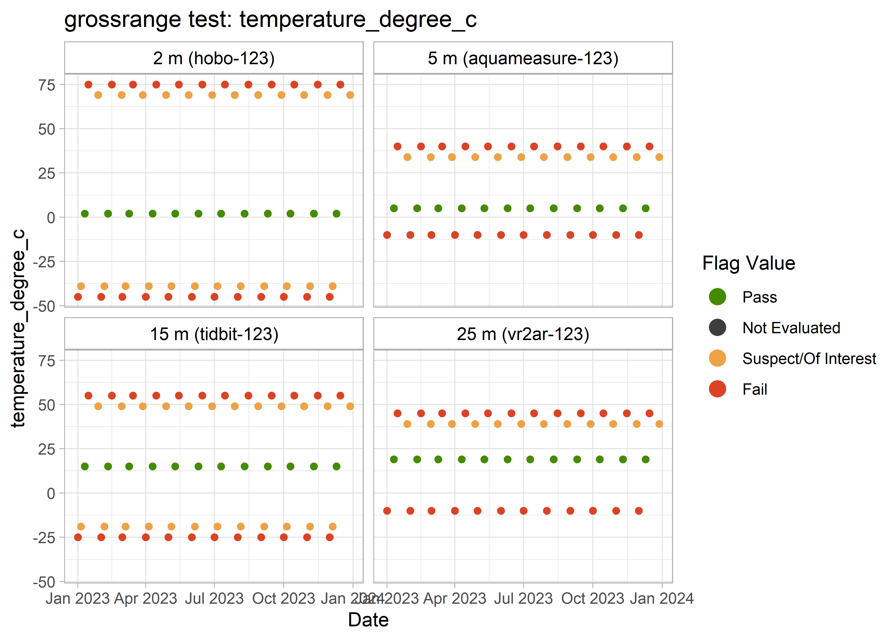
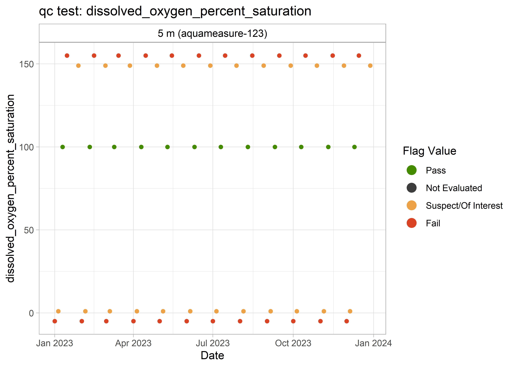
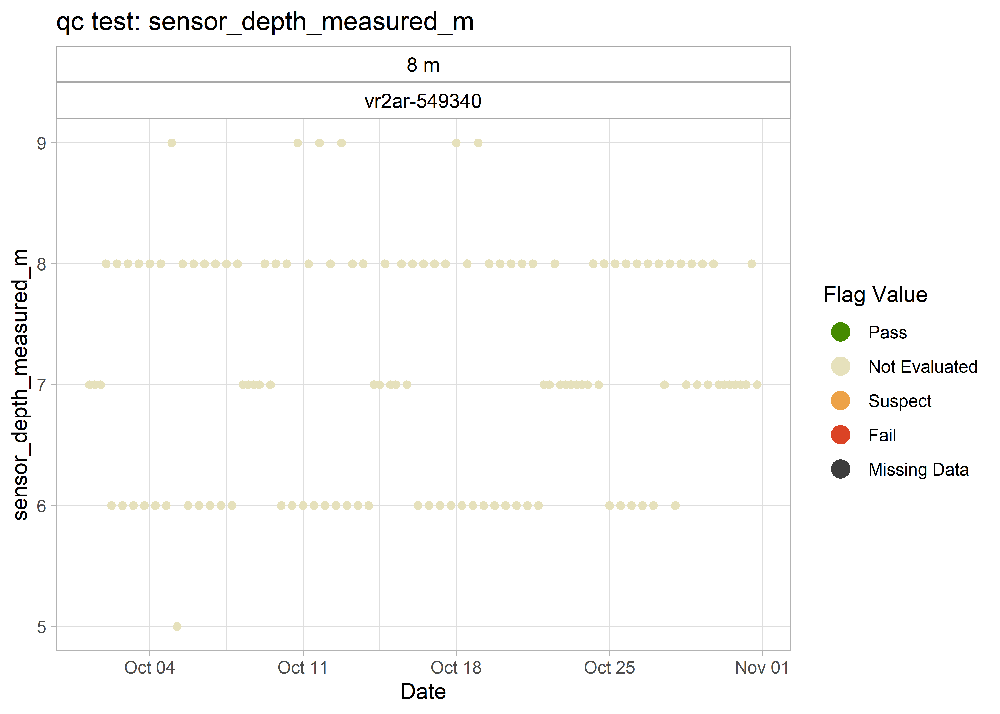

<!-- README.md is generated from README.Rmd. Please edit that file -->

# qaqcmar


<!-- badges: start -->

[](https://www.gnu.org/licenses/gpl-3.0)
[](https://github.com/dempsey-cmar/qaqcmar)
[](https://www.codefactor.io/repository/github/dempsey-cmar/qaqcmar)
[](https://github.com/dempsey-CMAR/qaqcmar/actions/workflows/R-CMD-check.yaml)
<!-- badges: end -->

The goal of qaqcmar is to apply quality control flags to Water Quality
data collected through the Centre for Marine Applied Research’s (CMAR)
Coastal Monitoring Program.

## Installation

You can install the development version of qaqcmar from
[GitHub](https://github.com/) with:

``` r
# install.packages("devtools")
devtools::install_github("dempsey-CMAR/qaqcmar")
```

## Background

-   Coastal Monitoring Program

-   QARTOD manuals

-   Tests that we are planning to run (include table)

-   Flagging scheme (include table)

-   Thresholds … defaults built into the package

## Example

``` r
library(qaqcmar)
library(sensorstrings)
library(dplyr)
library(kableExtra)
library(lubridate)
```

### Example Sensor String Data

Consider example Water Quality data collected from October 1, 2021 to
October 31, 2021. Note that some observations are far higher or lower
than what would be reasonably expected. (Note: this is fake data
generated from two deployments for illustrative purposes.)

``` r
# read in example data
path <- system.file("testdata", package = "qaqcmar")
# 
# dat <- read.csv(paste0(path, "/example_data.csv")) %>% 
#   select(
#     sensor, timestamp_utc, 
#     contains(c("depth", "temperature", "salinity", "dissolved_oxygen"))
#   ) %>% 
#   mutate(
#     timestamp_utc = paste0(timestamp_utc, ":00"),
#     timestamp_utc = as_datetime(timestamp_utc)
#   )

dat <- readRDS(paste0(path, "/test_data_grossrange.RDS")) %>% 
  select(-c(latitude, longitude))

kable(dat[1:5, ])
```

<table>
<thead>
<tr>
<th style="text-align:left;">
sensor_type
</th>
<th style="text-align:right;">
sensor_serial_number
</th>
<th style="text-align:left;">
timestamp_utc
</th>
<th style="text-align:left;">
sensor_depth_at_low_tide_m
</th>
<th style="text-align:right;">
dissolved_oxygen_percent_saturation
</th>
<th style="text-align:right;">
dissolved_oxygen_uncorrected_mg_per_L
</th>
<th style="text-align:right;">
salinity_psu
</th>
<th style="text-align:right;">
sensor_depth_measured_m
</th>
<th style="text-align:right;">
temperature_degree_C
</th>
</tr>
</thead>
<tbody>
<tr>
<td style="text-align:left;">
aquameasure
</td>
<td style="text-align:right;">
680360
</td>
<td style="text-align:left;">
2021-10-01 00:54:00
</td>
<td style="text-align:left;">
2
</td>
<td style="text-align:right;">
NA
</td>
<td style="text-align:right;">
NA
</td>
<td style="text-align:right;">
28.0
</td>
<td style="text-align:right;">
NA
</td>
<td style="text-align:right;">
15.68
</td>
</tr>
<tr>
<td style="text-align:left;">
aquameasure
</td>
<td style="text-align:right;">
680360
</td>
<td style="text-align:left;">
2021-10-01 01:54:00
</td>
<td style="text-align:left;">
2
</td>
<td style="text-align:right;">
NA
</td>
<td style="text-align:right;">
NA
</td>
<td style="text-align:right;">
27.7
</td>
<td style="text-align:right;">
NA
</td>
<td style="text-align:right;">
16.00
</td>
</tr>
<tr>
<td style="text-align:left;">
aquameasure
</td>
<td style="text-align:right;">
680360
</td>
<td style="text-align:left;">
2021-10-01 02:54:00
</td>
<td style="text-align:left;">
2
</td>
<td style="text-align:right;">
NA
</td>
<td style="text-align:right;">
NA
</td>
<td style="text-align:right;">
27.5
</td>
<td style="text-align:right;">
NA
</td>
<td style="text-align:right;">
16.16
</td>
</tr>
<tr>
<td style="text-align:left;">
aquameasure
</td>
<td style="text-align:right;">
680360
</td>
<td style="text-align:left;">
2021-10-01 03:54:00
</td>
<td style="text-align:left;">
2
</td>
<td style="text-align:right;">
NA
</td>
<td style="text-align:right;">
NA
</td>
<td style="text-align:right;">
27.2
</td>
<td style="text-align:right;">
NA
</td>
<td style="text-align:right;">
16.16
</td>
</tr>
<tr>
<td style="text-align:left;">
aquameasure
</td>
<td style="text-align:right;">
680360
</td>
<td style="text-align:left;">
2021-10-01 04:54:00
</td>
<td style="text-align:left;">
2
</td>
<td style="text-align:right;">
NA
</td>
<td style="text-align:right;">
NA
</td>
<td style="text-align:right;">
27.5
</td>
<td style="text-align:right;">
NA
</td>
<td style="text-align:right;">
16.09
</td>
</tr>
</tbody>
</table>

``` r
ss_ggplot_variables(dat)
```


### Apply QC flags

`qcqcmar` includes a separate function for each QC test. For example,
`qc_test_grossrange()` applies the gross range test by adding a a
`grossrange_flag_**` column for each variable in `dat`.

#### Gross Range Test

Apply test:

``` r
dat_gr <- qc_test_grossrange(dat)

kable(dat_gr[1:5, ])
```

<table>
<thead>
<tr>
<th style="text-align:left;">
sensor_type
</th>
<th style="text-align:right;">
sensor_serial_number
</th>
<th style="text-align:left;">
timestamp_utc
</th>
<th style="text-align:left;">
sensor_depth_at_low_tide_m
</th>
<th style="text-align:right;">
value_dissolved_oxygen_percent_saturation
</th>
<th style="text-align:right;">
value_dissolved_oxygen_uncorrected_mg_per_L
</th>
<th style="text-align:right;">
value_salinity_psu
</th>
<th style="text-align:right;">
value_sensor_depth_measured_m
</th>
<th style="text-align:right;">
value_temperature_degree_C
</th>
<th style="text-align:left;">
grossrange_flag_dissolved_oxygen_percent_saturation
</th>
<th style="text-align:left;">
grossrange_flag_dissolved_oxygen_uncorrected_mg_per_L
</th>
<th style="text-align:left;">
grossrange_flag_salinity_psu
</th>
<th style="text-align:left;">
grossrange_flag_sensor_depth_measured_m
</th>
<th style="text-align:left;">
grossrange_flag_temperature_degree_C
</th>
</tr>
</thead>
<tbody>
<tr>
<td style="text-align:left;">
aquameasure
</td>
<td style="text-align:right;">
680360
</td>
<td style="text-align:left;">
2021-10-01 00:54:00
</td>
<td style="text-align:left;">
2
</td>
<td style="text-align:right;">
NA
</td>
<td style="text-align:right;">
NA
</td>
<td style="text-align:right;">
28.0
</td>
<td style="text-align:right;">
NA
</td>
<td style="text-align:right;">
15.68
</td>
<td style="text-align:left;">
NA
</td>
<td style="text-align:left;">
NA
</td>
<td style="text-align:left;">
1
</td>
<td style="text-align:left;">
NA
</td>
<td style="text-align:left;">
1
</td>
</tr>
<tr>
<td style="text-align:left;">
aquameasure
</td>
<td style="text-align:right;">
680360
</td>
<td style="text-align:left;">
2021-10-01 01:54:00
</td>
<td style="text-align:left;">
2
</td>
<td style="text-align:right;">
NA
</td>
<td style="text-align:right;">
NA
</td>
<td style="text-align:right;">
27.7
</td>
<td style="text-align:right;">
NA
</td>
<td style="text-align:right;">
16.00
</td>
<td style="text-align:left;">
NA
</td>
<td style="text-align:left;">
NA
</td>
<td style="text-align:left;">
1
</td>
<td style="text-align:left;">
NA
</td>
<td style="text-align:left;">
1
</td>
</tr>
<tr>
<td style="text-align:left;">
aquameasure
</td>
<td style="text-align:right;">
680360
</td>
<td style="text-align:left;">
2021-10-01 02:54:00
</td>
<td style="text-align:left;">
2
</td>
<td style="text-align:right;">
NA
</td>
<td style="text-align:right;">
NA
</td>
<td style="text-align:right;">
27.5
</td>
<td style="text-align:right;">
NA
</td>
<td style="text-align:right;">
16.16
</td>
<td style="text-align:left;">
NA
</td>
<td style="text-align:left;">
NA
</td>
<td style="text-align:left;">
1
</td>
<td style="text-align:left;">
NA
</td>
<td style="text-align:left;">
1
</td>
</tr>
<tr>
<td style="text-align:left;">
aquameasure
</td>
<td style="text-align:right;">
680360
</td>
<td style="text-align:left;">
2021-10-01 03:54:00
</td>
<td style="text-align:left;">
2
</td>
<td style="text-align:right;">
NA
</td>
<td style="text-align:right;">
NA
</td>
<td style="text-align:right;">
27.2
</td>
<td style="text-align:right;">
NA
</td>
<td style="text-align:right;">
16.16
</td>
<td style="text-align:left;">
NA
</td>
<td style="text-align:left;">
NA
</td>
<td style="text-align:left;">
1
</td>
<td style="text-align:left;">
NA
</td>
<td style="text-align:left;">
1
</td>
</tr>
<tr>
<td style="text-align:left;">
aquameasure
</td>
<td style="text-align:right;">
680360
</td>
<td style="text-align:left;">
2021-10-01 04:54:00
</td>
<td style="text-align:left;">
2
</td>
<td style="text-align:right;">
NA
</td>
<td style="text-align:right;">
NA
</td>
<td style="text-align:right;">
27.5
</td>
<td style="text-align:right;">
NA
</td>
<td style="text-align:right;">
16.09
</td>
<td style="text-align:left;">
NA
</td>
<td style="text-align:left;">
NA
</td>
<td style="text-align:left;">
1
</td>
<td style="text-align:left;">
NA
</td>
<td style="text-align:left;">
1
</td>
</tr>
</tbody>
</table>

The flagged data can be plotted with `qc_plot_flags()`, specifying
argument `qc_tests = "grossrange"`.

``` r
qc_plot_flags(dat_gr, qc_tests = "grossrange", ncol = 2)
#> $salinity_psu
#> $salinity_psu$grossrange
```


    #> 
    #> 
    #> $temperature_degree_C
    #> $temperature_degree_C$grossrange



    #> 
    #> 
    #> $dissolved_oxygen_percent_saturation
    #> $dissolved_oxygen_percent_saturation$grossrange


    #> 
    #> 
    #> $dissolved_oxygen_uncorrected_mg_per_L
    #> $dissolved_oxygen_uncorrected_mg_per_L$grossrange


    #> 
    #> 
    #> $sensor_depth_measured_m
    #> $sensor_depth_measured_m$grossrange


#### All Tests

`qc_test_all()` will apply all specified QC tests to `dat`.

``` r
dat_qc <- dat %>% 
  qc_test_all(qc_tests = c("climatology", "grossrange")) 
#> Joining, by = c("sensor_type", "sensor_serial_number", "timestamp_utc",
#> "sensor_depth_at_low_tide_m", "value_dissolved_oxygen_percent_saturation",
#> "value_dissolved_oxygen_uncorrected_mg_per_L", "value_salinity_psu",
#> "value_sensor_depth_measured_m", "value_temperature_degree_C")

kable(dat_qc[1:5, ])
```

<table>
<thead>
<tr>
<th style="text-align:left;">
sensor_type
</th>
<th style="text-align:right;">
sensor_serial_number
</th>
<th style="text-align:left;">
timestamp_utc
</th>
<th style="text-align:left;">
sensor_depth_at_low_tide_m
</th>
<th style="text-align:right;">
value_dissolved_oxygen_percent_saturation
</th>
<th style="text-align:right;">
value_dissolved_oxygen_uncorrected_mg_per_L
</th>
<th style="text-align:right;">
value_salinity_psu
</th>
<th style="text-align:right;">
value_sensor_depth_measured_m
</th>
<th style="text-align:right;">
value_temperature_degree_C
</th>
<th style="text-align:left;">
climatology_flag_dissolved_oxygen_percent_saturation
</th>
<th style="text-align:left;">
climatology_flag_dissolved_oxygen_uncorrected_mg_per_L
</th>
<th style="text-align:left;">
climatology_flag_salinity_psu
</th>
<th style="text-align:left;">
climatology_flag_sensor_depth_measured_m
</th>
<th style="text-align:left;">
climatology_flag_temperature_degree_C
</th>
<th style="text-align:left;">
grossrange_flag_dissolved_oxygen_percent_saturation
</th>
<th style="text-align:left;">
grossrange_flag_dissolved_oxygen_uncorrected_mg_per_L
</th>
<th style="text-align:left;">
grossrange_flag_salinity_psu
</th>
<th style="text-align:left;">
grossrange_flag_sensor_depth_measured_m
</th>
<th style="text-align:left;">
grossrange_flag_temperature_degree_C
</th>
</tr>
</thead>
<tbody>
<tr>
<td style="text-align:left;">
aquameasure
</td>
<td style="text-align:right;">
680360
</td>
<td style="text-align:left;">
2021-10-01 00:54:00
</td>
<td style="text-align:left;">
2
</td>
<td style="text-align:right;">
NA
</td>
<td style="text-align:right;">
NA
</td>
<td style="text-align:right;">
28.0
</td>
<td style="text-align:right;">
NA
</td>
<td style="text-align:right;">
15.68
</td>
<td style="text-align:left;">
NA
</td>
<td style="text-align:left;">
NA
</td>
<td style="text-align:left;">
1
</td>
<td style="text-align:left;">
NA
</td>
<td style="text-align:left;">
1
</td>
<td style="text-align:left;">
NA
</td>
<td style="text-align:left;">
NA
</td>
<td style="text-align:left;">
1
</td>
<td style="text-align:left;">
NA
</td>
<td style="text-align:left;">
1
</td>
</tr>
<tr>
<td style="text-align:left;">
aquameasure
</td>
<td style="text-align:right;">
680360
</td>
<td style="text-align:left;">
2021-10-01 01:54:00
</td>
<td style="text-align:left;">
2
</td>
<td style="text-align:right;">
NA
</td>
<td style="text-align:right;">
NA
</td>
<td style="text-align:right;">
27.7
</td>
<td style="text-align:right;">
NA
</td>
<td style="text-align:right;">
16.00
</td>
<td style="text-align:left;">
NA
</td>
<td style="text-align:left;">
NA
</td>
<td style="text-align:left;">
1
</td>
<td style="text-align:left;">
NA
</td>
<td style="text-align:left;">
1
</td>
<td style="text-align:left;">
NA
</td>
<td style="text-align:left;">
NA
</td>
<td style="text-align:left;">
1
</td>
<td style="text-align:left;">
NA
</td>
<td style="text-align:left;">
1
</td>
</tr>
<tr>
<td style="text-align:left;">
aquameasure
</td>
<td style="text-align:right;">
680360
</td>
<td style="text-align:left;">
2021-10-01 02:54:00
</td>
<td style="text-align:left;">
2
</td>
<td style="text-align:right;">
NA
</td>
<td style="text-align:right;">
NA
</td>
<td style="text-align:right;">
27.5
</td>
<td style="text-align:right;">
NA
</td>
<td style="text-align:right;">
16.16
</td>
<td style="text-align:left;">
NA
</td>
<td style="text-align:left;">
NA
</td>
<td style="text-align:left;">
1
</td>
<td style="text-align:left;">
NA
</td>
<td style="text-align:left;">
1
</td>
<td style="text-align:left;">
NA
</td>
<td style="text-align:left;">
NA
</td>
<td style="text-align:left;">
1
</td>
<td style="text-align:left;">
NA
</td>
<td style="text-align:left;">
1
</td>
</tr>
<tr>
<td style="text-align:left;">
aquameasure
</td>
<td style="text-align:right;">
680360
</td>
<td style="text-align:left;">
2021-10-01 03:54:00
</td>
<td style="text-align:left;">
2
</td>
<td style="text-align:right;">
NA
</td>
<td style="text-align:right;">
NA
</td>
<td style="text-align:right;">
27.2
</td>
<td style="text-align:right;">
NA
</td>
<td style="text-align:right;">
16.16
</td>
<td style="text-align:left;">
NA
</td>
<td style="text-align:left;">
NA
</td>
<td style="text-align:left;">
1
</td>
<td style="text-align:left;">
NA
</td>
<td style="text-align:left;">
1
</td>
<td style="text-align:left;">
NA
</td>
<td style="text-align:left;">
NA
</td>
<td style="text-align:left;">
1
</td>
<td style="text-align:left;">
NA
</td>
<td style="text-align:left;">
1
</td>
</tr>
<tr>
<td style="text-align:left;">
aquameasure
</td>
<td style="text-align:right;">
680360
</td>
<td style="text-align:left;">
2021-10-01 04:54:00
</td>
<td style="text-align:left;">
2
</td>
<td style="text-align:right;">
NA
</td>
<td style="text-align:right;">
NA
</td>
<td style="text-align:right;">
27.5
</td>
<td style="text-align:right;">
NA
</td>
<td style="text-align:right;">
16.09
</td>
<td style="text-align:left;">
NA
</td>
<td style="text-align:left;">
NA
</td>
<td style="text-align:left;">
1
</td>
<td style="text-align:left;">
NA
</td>
<td style="text-align:left;">
1
</td>
<td style="text-align:left;">
NA
</td>
<td style="text-align:left;">
NA
</td>
<td style="text-align:left;">
1
</td>
<td style="text-align:left;">
NA
</td>
<td style="text-align:left;">
1
</td>
</tr>
</tbody>
</table>

There are now 19 columns in `dat_qc`!

`qc_assign_max_flag()` reduces the number of columns in `dat_qc` by
keeping the *worst* flag for each variable.

``` r
dat_qc <- dat_qc %>% 
 qc_assign_max_flag()

kable(dat_qc[1:5, ])
```

<table>
<thead>
<tr>
<th style="text-align:left;">
sensor_type
</th>
<th style="text-align:right;">
sensor_serial_number
</th>
<th style="text-align:left;">
timestamp_utc
</th>
<th style="text-align:left;">
sensor_depth_at_low_tide_m
</th>
<th style="text-align:right;">
value_dissolved_oxygen_percent_saturation
</th>
<th style="text-align:right;">
value_dissolved_oxygen_uncorrected_mg_per_L
</th>
<th style="text-align:right;">
value_salinity_psu
</th>
<th style="text-align:right;">
value_sensor_depth_measured_m
</th>
<th style="text-align:right;">
value_temperature_degree_C
</th>
<th style="text-align:left;">
qc_flag_dissolved_oxygen_percent_saturation
</th>
<th style="text-align:left;">
qc_flag_dissolved_oxygen_uncorrected_mg_per_L
</th>
<th style="text-align:left;">
qc_flag_salinity_psu
</th>
<th style="text-align:left;">
qc_flag_sensor_depth_measured_m
</th>
<th style="text-align:left;">
qc_flag_temperature_degree_C
</th>
</tr>
</thead>
<tbody>
<tr>
<td style="text-align:left;">
aquameasure
</td>
<td style="text-align:right;">
680360
</td>
<td style="text-align:left;">
2021-10-01 00:54:00
</td>
<td style="text-align:left;">
2
</td>
<td style="text-align:right;">
NA
</td>
<td style="text-align:right;">
NA
</td>
<td style="text-align:right;">
28.0
</td>
<td style="text-align:right;">
NA
</td>
<td style="text-align:right;">
15.68
</td>
<td style="text-align:left;">
NA
</td>
<td style="text-align:left;">
NA
</td>
<td style="text-align:left;">
1
</td>
<td style="text-align:left;">
NA
</td>
<td style="text-align:left;">
1
</td>
</tr>
<tr>
<td style="text-align:left;">
aquameasure
</td>
<td style="text-align:right;">
680360
</td>
<td style="text-align:left;">
2021-10-01 01:54:00
</td>
<td style="text-align:left;">
2
</td>
<td style="text-align:right;">
NA
</td>
<td style="text-align:right;">
NA
</td>
<td style="text-align:right;">
27.7
</td>
<td style="text-align:right;">
NA
</td>
<td style="text-align:right;">
16.00
</td>
<td style="text-align:left;">
NA
</td>
<td style="text-align:left;">
NA
</td>
<td style="text-align:left;">
1
</td>
<td style="text-align:left;">
NA
</td>
<td style="text-align:left;">
1
</td>
</tr>
<tr>
<td style="text-align:left;">
aquameasure
</td>
<td style="text-align:right;">
680360
</td>
<td style="text-align:left;">
2021-10-01 02:54:00
</td>
<td style="text-align:left;">
2
</td>
<td style="text-align:right;">
NA
</td>
<td style="text-align:right;">
NA
</td>
<td style="text-align:right;">
27.5
</td>
<td style="text-align:right;">
NA
</td>
<td style="text-align:right;">
16.16
</td>
<td style="text-align:left;">
NA
</td>
<td style="text-align:left;">
NA
</td>
<td style="text-align:left;">
1
</td>
<td style="text-align:left;">
NA
</td>
<td style="text-align:left;">
1
</td>
</tr>
<tr>
<td style="text-align:left;">
aquameasure
</td>
<td style="text-align:right;">
680360
</td>
<td style="text-align:left;">
2021-10-01 03:54:00
</td>
<td style="text-align:left;">
2
</td>
<td style="text-align:right;">
NA
</td>
<td style="text-align:right;">
NA
</td>
<td style="text-align:right;">
27.2
</td>
<td style="text-align:right;">
NA
</td>
<td style="text-align:right;">
16.16
</td>
<td style="text-align:left;">
NA
</td>
<td style="text-align:left;">
NA
</td>
<td style="text-align:left;">
1
</td>
<td style="text-align:left;">
NA
</td>
<td style="text-align:left;">
1
</td>
</tr>
<tr>
<td style="text-align:left;">
aquameasure
</td>
<td style="text-align:right;">
680360
</td>
<td style="text-align:left;">
2021-10-01 04:54:00
</td>
<td style="text-align:left;">
2
</td>
<td style="text-align:right;">
NA
</td>
<td style="text-align:right;">
NA
</td>
<td style="text-align:right;">
27.5
</td>
<td style="text-align:right;">
NA
</td>
<td style="text-align:right;">
16.09
</td>
<td style="text-align:left;">
NA
</td>
<td style="text-align:left;">
NA
</td>
<td style="text-align:left;">
1
</td>
<td style="text-align:left;">
NA
</td>
<td style="text-align:left;">
1
</td>
</tr>
</tbody>
</table>

The flagged data can be plotted with `qc_plot_flags()`, specifying
argument `qc_tests = "qc"`.

``` r
qc_plot_flags(dat_qc, qc_tests = "qc")
#> Warning: Coercing `ncol` to be an integer.
#> Warning in sanitise_dim(ncol): NAs introduced by coercion
#> Warning: `ncol` is missing or less than 1 and will be treated as NULL.
#> Warning: Coercing `ncol` to be an integer.
#> Warning in sanitise_dim(ncol): NAs introduced by coercion
#> Warning: `ncol` is missing or less than 1 and will be treated as NULL.
#> Warning: Coercing `ncol` to be an integer.
#> Warning in sanitise_dim(ncol): NAs introduced by coercion
#> Warning: `ncol` is missing or less than 1 and will be treated as NULL.
#> Warning: Coercing `ncol` to be an integer.
#> Warning in sanitise_dim(ncol): NAs introduced by coercion
#> Warning: `ncol` is missing or less than 1 and will be treated as NULL.
#> Warning: Coercing `ncol` to be an integer.
#> Warning in sanitise_dim(ncol): NAs introduced by coercion
#> Warning: `ncol` is missing or less than 1 and will be treated as NULL.
#> $salinity_psu
#> $salinity_psu$qc
```



    #> 
    #> 
    #> $temperature_degree_C
    #> $temperature_degree_C$qc


    #> 
    #> 
    #> $dissolved_oxygen_percent_saturation
    #> $dissolved_oxygen_percent_saturation$qc


    #> 
    #> 
    #> $dissolved_oxygen_uncorrected_mg_per_L
    #> $dissolved_oxygen_uncorrected_mg_per_L$qc


    #> 
    #> 
    #> $sensor_depth_measured_m
    #> $sensor_depth_measured_m$qc


